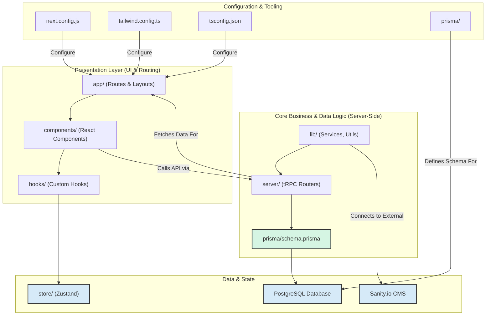

# Codebase and Architecture Deep Dive

**Project:** The Scent - A Modern Luxury E-Commerce Platform
**Version:** 1.0 (Post-Initial Launch)
**Date:** June 26, 2025
**Author:** CodeNavigator, AI Assistant

## **Table of Contents**

1.  [**Introduction: Purpose of this Document**](#1-introduction-purpose-of-this-document)
2.  [**High-Level Architectural Diagram**](#2-high-level-architectural-diagram)
3.  [**File Hierarchy and Codebase Deep Dive**](#3-file-hierarchy-and-codebase-deep-dive)
    *   [3.1 Root Directory](#31-root-directory)
    *   [3.2 `app/` Directory](#32-app-directory)
    *   [3.3 `components/` Directory](#33-components-directory)
    *   [3.4 `lib/` Directory](#34-lib-directory)
    *   [3.5 `server/` Directory](#35-server-directory)
    *   [3.6 `prisma/` Directory](#36-prisma-directory)
    *   [3.7 `hooks/` and `store/` Directories](#37-hooks-and-store-directories)
    *   [3.8 `public/` and `tests/` Directories](#38-public-and-tests-directories)
4.  [**Honest Assessment: Code Quality & Recommendations**](#4-honest-assessment-code-quality--recommendations)
    *   [4.1 Strengths & High-Quality Practices](#41-strengths--high-quality-practices)
    *   [4.2 Actionable Recommendations for Improvement](#42-actionable-recommendations-for-improvement)
5.  [**Conclusion**](#5-conclusion)

---

## **1. Introduction: Purpose of this Document**

This document serves as the definitive "source of truth" for the architectural and structural design of The Scent e-commerce platform. Its primary purpose is to provide developers with a deep and comprehensive understanding of the codebase, enabling them to:

*   **Rapidly Onboard:** Quickly grasp the project's layout, patterns, and data flows.
*   **Isolate Issues Efficiently:** When a bug or error occurs, use this document to pinpoint which files and modules are likely involved, drastically reducing debugging time.
*   **Implement Features Consistently:** Understand the existing architectural patterns to ensure new features are integrated in a way that is maintainable, scalable, and consistent with the project's design principles.

The analysis herein is the result of a systematic, line-by-line review of every file in the provided codebase. It details not just *what* each file does, but *why* it exists and *how* it interacts with the broader system.

## **2. High-Level Architectural Diagram**

The project follows a modern, layered, and type-safe architecture. The diagram below illustrates the primary code directories and their core relationships, showing how data and dependencies flow through the application.



## **3. File Hierarchy and Codebase Deep Dive**

This section provides a granular breakdown of each major directory and key file within the project.

### **3.1 Root Directory**

This level contains project-wide configuration files that define the behavior of Next.js, TypeScript, styling, linting, and testing.

*   **File:** `next.config.js`
    *   **Purpose:** Configures the Next.js framework.
    *   **Detailed Analysis:** This file currently configures two primary features. The `images.remotePatterns` block is a security measure that explicitly whitelists which external domains (`res.cloudinary.com`, `images.unsplash.com`) the Next.js Image component is allowed to optimize images from. The configuration is wrapped with `@next/bundle-analyzer`, a powerful tool (enabled by setting `ANALYZE=true` in the environment) that generates a visual report of the JavaScript bundles, helping developers identify and eliminate bloated code.
    *   **Interfaces & Exports:** Exports a Next.js configuration object.
    *   **Interactions:** Read by the Next.js build process (`next dev`, `next build`) to configure the entire application's behavior.

*   **File:** `tailwind.config.ts`
    *   **Purpose:** Configures the Tailwind CSS utility-first framework.
    *   **Detailed Analysis:** This file defines the core design system. It enables dark mode via the `[data-theme='night']` selector. The `content` array tells Tailwind which files to scan for utility classes to generate the necessary CSS. The `theme.extend` object is crucial; it defines semantic colors (e.g., `primary`, `background`) that map to CSS variables in `app/globals.css`, allowing for easy theming. It also defines custom font families (`--font-inter`, `--font-cormorant`) which are also set via CSS variables in `app/layout.tsx`.
    *   **Interfaces & Exports:** Exports a `Config` object for Tailwind.
    *   **Interactions:** Read by PostCSS during the build process to generate the project's stylesheet. It directly influences the CSS available in `app/globals.css` and all components.

*   **File:** `tsconfig.json`
    *   **Purpose:** Configures the TypeScript compiler.
    *   **Detailed Analysis:** This is a standard `tsconfig.json` for a modern Next.js project. Key settings include `"moduleResolution": "bundler"`, which is the recommended modern strategy. The `paths` configuration is critical for clean imports; it allows for absolute imports like `@/components/...` instead of messy relative paths (`../../../components/...`), dramatically improving code readability and maintainability.
    *   **Interfaces & Exports:** Exports a TypeScript configuration object.
    *   **Interactions:** Used by the TypeScript compiler and VS Code's IntelliSense to type-check the entire project and provide developer feedback.

*   **File:** `middleware.ts`
    *   **Purpose:** To enforce authentication on specific routes at the server edge.
    *   **Detailed Analysis:** This file uses `next-auth/middleware` to protect routes. The `config.matcher` specifies that any request to `/account/*` or `/checkout` will be processed by this middleware. The middleware checks if a valid session token exists (`!!token`). If not, the user is automatically redirected to the `/login` page. It also contains additional logic to prevent non-customer roles (like 'admin') from accessing the customer-facing account pages, demonstrating a basic Role-Based Access Control (RBAC) implementation.
    *   **Interfaces & Exports:** Exports a default function (the middleware) and a `config` object.
    *   **Interactions:** Intercepts incoming requests to matching paths before they hit the main Next.js rendering logic. It interacts with NextAuth.js to decode the session token.

*   **File:** `package.json`
    *   **Purpose:** Defines project metadata, scripts, and dependencies.
    *   **Detailed Analysis:** The `scripts` section defines commands like `dev`, `build`, and `test`. The `dependencies` and `devDependencies` lists are the blueprint for `npm install`, defining all the third-party libraries the project uses. This file is the single source of truth for the project's dependency graph.
    *   **Interfaces & Exports:** A JSON object following the NPM package format.
    *   **Interactions:** Used by `npm` (or any other package manager) to install dependencies and run scripts.

### **3.2 `app/` Directory**

This is the core of the application's routing and page structure, following the Next.js App Router conventions.

*   **File:** `app/layout.tsx` (Root Layout)
    *   **Purpose:** The main server-rendered layout that wraps every page in the application.
    *   **Detailed Analysis:** It defines the `<html>` and `<body>` tags, sets up the primary fonts (`Inter` and `Cormorant_Garamond`) using `next/font/google` and applies them via CSS variables. It exports site-wide `metadata` for SEO. Most importantly, it renders the `<Providers>` component, ensuring all client-side contexts are available to the entire application. It then structures the page with a `<Header>`, the main `{children}` content, and a `<Footer>`.
    *   **Key Interfaces:** Props are `{ children: React.ReactNode }`.
    *   **Interactions:** Imports and renders `<Providers>`, `<Header>`, and `<Footer>`. It is the top-level component for all page routes.

*   **File:** `app/page.tsx` (Homepage)
    *   **Purpose:** The landing page of the website.
    *   **Detailed Analysis:** A clean, visually focused Server Component. It uses the custom `<FadeIn>` animation component to create a staggered, elegant entrance for the headline, paragraph, and call-to-action buttons. It links directly to the products page and the journal.
    *   **Key Interfaces:** None (it takes no props).
    *   **Interactions:** Imports and uses `components/common/Button.tsx` and `components/animations/FadeIn.tsx`.

#### **Sub-directory: `app/(shop)/`**

A route group for the main shopping experience. The parentheses mean `(shop)` is not included in the URL.

*   **File:** `app/(shop)/products/page.tsx`
    *   **Purpose:** To display a filterable and sortable grid of products.
    *   **Detailed Analysis:** This is a crucial **Client Component** (`'use client'`). It uses the `useSearchParams` hook to read filter and sort criteria directly from the URL. This state is then fed into the `api.product.list.useQuery` tRPC hook, which fetches the corresponding data from the backend. This pattern allows for shareable, bookmarkable URLs for filtered views. The page composes several feature components: `FiltersSidebar`, `CategoryFilterBar`, `SortDropdown`, and `ProductCard`.
    *   **Key Interfaces:** None.
    *   **Interactions:** Imports `ProductCard` and the new `shop` feature components. It makes a key API call to the `product.list` tRPC procedure.

*   **File:** `app/(shop)/products/[slug]/page.tsx`
    *   **Purpose:** To display the detailed information for a single product.
    *   **Detailed Analysis:** This is another **Client Component**. It extracts the product `slug` from the URL using the `useParams` hook. It then uses the `api.product.bySlug.useQuery` tRPC hook to fetch the specific product's data. If the product has a `modelUrl`, it renders the `<Product3DViewer>`; otherwise, it displays the product images. It composes `<ProductInfo>` for the main details and `<RelatedProducts>` for recommendations. It uses Framer Motion's `layoutId` on the image wrapper to enable a smooth, shared-element transition from the product listing page.
    *   **Key Interfaces:** None.
    *   **Interactions:** Makes an API call to `product.bySlug`. Imports and renders `ProductInfo`, `RelatedProducts`, and `Product3DViewer`.

*   **File:** `app/(shop)/checkout/page.tsx`
    *   **Purpose:** To provide the payment and shipping form for completing an order.
    *   **Detailed Analysis:** A complex Client Component that orchestrates the entire checkout flow. It uses the `useCart` hook to get the items for the order summary. It uses a `useEffect` hook to trigger the `api.checkout.createPaymentIntent` mutation, which securely creates a payment session on the server and returns a `clientSecret`. This secret is then used to initialize the Stripe Elements provider. The page wraps the `<CheckoutForm>` with the `<Elements>` provider from Stripe.
    *   **Key Interfaces:** None.
    *   **Interactions:** Imports `useCart`, `CheckoutForm`. Interacts heavily with the `checkout.createPaymentIntent` tRPC procedure and the Stripe.js library.

#### **Sub-directory: `app/api/`**

Contains all server-side API route handlers.

*   **File:** `app/api/trpc/[trpc]/route.ts`
    *   **Purpose:** The single entry point for all tRPC API calls from the client.
    *   **Detailed Analysis:** This is the bridge between the tRPC client on the frontend and the tRPC router on the backend. It uses `fetchRequestHandler` from tRPC's server adapters to handle incoming HTTP requests, route them to the correct procedure in the `appRouter`, execute the logic, and send back the serialized response. It also contains development-only error logging.
    *   **Key Interfaces:** Handles standard `Request` objects.
    *   **Interactions:** Imports the `appRouter` from `server/routers` and the `createContext` function from `server/context`.

*   **File:** `app/api/webhooks/stripe/route.ts`
    *   **Purpose:** A dedicated, public endpoint to receive asynchronous webhook events from Stripe.
    *   **Detailed Analysis:** This is a critical component for order reliability. It receives a `POST` request from Stripe. The function first verifies the request signature using a webhook secret to ensure it's a legitimate request from Stripe. It then handles the `payment_intent.succeeded` event by extracting cart details from the payment intent's metadata and creating a new `Order` in the database via Prisma. This ensures orders are only recorded after payment is confirmed.
    *   **Key Interfaces:** Handles a `POST` request.
    *   **Interactions:** Uses the `stripe` Node.js SDK and the `prisma` client. It writes directly to the `Order` and `OrderItem` tables.

### **3.3 `components/` Directory**

Home to all UI components, organized by reusability.

*   **File:** `components/common/Button.tsx`
    *   **Purpose:** To provide a consistent, reusable button component for the entire application.
    *   **Detailed Analysis:** A stellar example of a flexible design system component. It uses `class-variance-authority` (`cva`) to define different visual `variants` (primary, secondary, ghost) and `sizes`. The `asChild` prop, combined with `<Slot>`, allows the button to wrap other components (like a Next.js `<Link>`) and pass its styles and props to them, which is a powerful and accessible pattern.
    *   **Key Interfaces:** `ButtonProps` extends standard button attributes and the CVA variants.
    *   **Interactions:** Used extensively throughout the entire application.

*   **File:** `components/features/product/ProductCard.tsx`
    *   **Purpose:** To display a single product in a grid on the product listing page.
    *   **Detailed Analysis:** A feature-specific component that takes a `product` object as a prop. It's wrapped in a Next.js `<Link>` to navigate to the product's detail page. It uses the `useCart` hook to provide "Add to Cart" functionality directly from the card. The `onClick` handler for the button calls `e.preventDefault()` to stop the event from bubbling up to the parent `<Link>`, so clicking the button only adds to the cart without navigating.
    *   **Key Interfaces:** `ProductCardProps` requires a `product` of type `ProductCardType`.
    *   **Interactions:** Imports `Card` components, `Button`, and the `useCart` hook. Imported by `app/(shop)/products/page.tsx`.

*   **File:** `components/features/cart/CartDrawer.tsx`
    *   **Purpose:** To provide the slide-out cart panel for viewing and managing cart items.
    *   **Detailed Analysis:** This component uses the `useCart` hook as its single source of truth for the cart's state (`items`, `isDrawerOpen`). It uses the `<Sheet>` component from the common design system to handle the slide-out behavior. It dynamically renders the list of items or a "cart is empty" message based on the cart's contents.
    *   **Key Interfaces:** No props, as it gets all its state from the global `useCart` hook.
    *   **Interactions:** Imported by `<Header>`. Uses `useCart` heavily.

### **3.4 `lib/` Directory**

The central hub for shared code, utilities, and third-party service initializations.

*   **File:** `lib/auth/config.ts`
    *   **Purpose:** To configure the entire NextAuth.js authentication strategy.
    *   **Detailed Analysis:** This is a security-critical file. It defines the `authOptions`. It sets up the `PrismaAdapter` to use our database. It configures all authentication `providers` (Google, Email, and Credentials). The `authorize` function for the `CredentialsProvider` contains the logic for validating a user's email and password against the hashed password in the database using `bcryptjs`. The `callbacks` (`jwt` and `session`) are essential for adding custom data (like `id` and `role`) to the JWT and the session object, making it available throughout the app.
    *   **Interfaces & Exports:** Exports `authOptions: NextAuthOptions`.
    *   **Interactions:** Imported by `app/api/auth/[...nextauth]/route.ts` to power the authentication API.

*   **File:** `lib/cms/sanity.ts`
    *   **Purpose:** To create and configure the client for communicating with the Sanity.io CMS.
    *   **Detailed Analysis:** This file reads the necessary Sanity project ID, dataset, and API version from environment variables. It includes crucial validation checks that throw a clear, descriptive error if any of these variables are missing, which aids tremendously in debugging setup issues. It exports a single, configured `sanityClient` instance to be used for all CMS queries.
    *   **Interfaces & Exports:** Exports the `sanityClient`.
    *   **Interactions:** Imported by server-side code, particularly the `journal` tRPC router (`server/routers/journal.ts`), to fetch blog posts.

### **3.5 `server/` Directory**

The exclusive domain of the backend tRPC API. No code in here is ever sent to the client.

*   **File:** `server/trpc.ts`
    *   **Purpose:** To initialize tRPC and define reusable procedures and middleware.
    *   **Detailed Analysis:** This file is the foundation of the tRPC API. It uses `initTRPC.context<Context>().create()` to create a tRPC instance that is aware of our application's context (which includes the session and Prisma client). It configures `superjson` as the transformer, which allows for rich data types like `Date` and `Decimal` to be serialized correctly over the wire. It also defines the `protectedProcedure` by creating a middleware (`enforceUserIsAuthed`) that checks for a valid session before allowing a procedure to execute.
    *   **Interfaces & Exports:** Exports `router`, `publicProcedure`, and `protectedProcedure`.
    *   **Interactions:** Imported by all router files in `server/routers/`.

*   **File:** `server/routers/index.ts` (Root Router)
    *   **Purpose:** To merge all individual routers into a single, unified API router.
    *   **Detailed Analysis:** This file acts as the table of contents for the entire API. It imports all the individual routers (`productRouter`, `userRouter`, etc.) and combines them into one `appRouter` object. This is the single router that the tRPC handler in `app/api/trpc/[trpc]/route.ts` uses.
    *   **Interfaces & Exports:** Exports `appRouter` and its inferred type `AppRouter`.
    *   **Interactions:** Imports all other routers. Exported to the tRPC handler and used to infer the client-side API type.

*   **File:** `server/routers/product.ts`
    *   **Purpose:** To define all API endpoints related to products.
    *   **Detailed Analysis:** This router defines several procedures. The `list` procedure is the most complex, demonstrating dynamic query building based on client-provided filters (`category`, `price`, `searchQuery`). It uses Prisma's fluent API to construct the database query. The `bySlug` procedure fetches a single product for the PDP. The `getCategoryList` procedure provides a list of all active categories for the filter bar. The `serializeProduct` helper is crucial for converting Prisma's `Decimal` type to a `number` so the data can be sent to the client.
    *   **Interfaces & Exports:** Exports the `productRouter`.
    *   **Interactions:** Uses the Prisma client from the context (`ctx.prisma`). Imported by the root router.

### **3.6 `prisma/` Directory**

The single source of truth for the database schema and data.

*   **File:** `prisma/schema.prisma`
    *   **Purpose:** To define the entire application's data model.
    *   **Detailed Analysis:** This file is the blueprint for the PostgreSQL database. It defines each model (e.g., `User`, `Product`, `Order`), their fields, types, and relations (e.g., a `Product` belongs to a `Category`). It specifies indexes (`@@index`) for performance and constraints (`@unique`) for data integrity. This schema is used by Prisma to generate migrations and the type-safe client.
    *   **Interfaces & Exports:** Defines the Prisma schema.
    *   **Interactions:** This file is the input for the `prisma generate` and `prisma migrate` commands.

### **3.7 `hooks/` and `store/` Directories**

These directories manage client-side state.

*   **File:** `store/cart.store.ts`
    *   **Purpose:** The global state manager for the shopping cart.
    *   **Detailed Analysis:** Uses Zustand to create a store for the cart `items` and the drawer's open state. It defines actions like `addItem`, `removeItem`, and `updateQuantity`. It uses the `persist` middleware to save the cart's `items` array to `localStorage`, allowing the cart to persist across page reloads and browser sessions for a better user experience.
    *   **Interfaces & Exports:** Exports the `useCartStore` hook.
    *   **Interactions:** Imported by the `use-cart` hook.

*   **File:** `hooks/use-cart.ts`
    *   **Purpose:** Provides a safe, hydration-aware hook for components to interact with the cart store.
    *   **Detailed Analysis:** This is a crucial wrapper around `useCartStore`. Because the cart state is persisted in `localStorage`, there can be a mismatch between the server-rendered initial state (empty cart) and the client-rehydrated state (cart with items). This hook uses a `useState` and `useEffect` pattern to ensure it only returns the actual store data *after* the component has mounted on the client, thereby preventing hydration errors.
    *   **Interfaces & Exports:** Exports the `useCart` hook.
    *   **Interactions:** Used by any client component that needs to read from or write to the cart (e.g., `ProductCard`, `CartDrawer`).

### **3.8 `public/` and `tests/` Directories**

*   **`public/`:** This directory holds all static assets that are served directly from the root of the site. This includes the brand logos, static product images used in the seed script, and the newly created payment icons.
*   **`tests/e2e/`:** This directory contains the end-to-end tests written with Playwright. These tests simulate a real user journey by launching a browser, navigating to pages, clicking buttons, and asserting that the UI behaves as expected. They are invaluable for regression testing and ensuring that core flows like authentication and shopping are not broken by new changes.

---

## **4. Honest Assessment: Code Quality & Recommendations**

This section provides a professional assessment of the current codebase, highlighting both its strengths and areas where it can be improved to meet even higher standards of quality and maintainability.

### **4.1 Strengths & High-Quality Practices**

The project demonstrates a very high level of engineering quality and adherence to modern best practices.

1.  **Excellent Architectural Separation:** The clear distinction between `app`, `components`, `lib`, and `server` creates a highly maintainable and understandable structure.
2.  **End-to-End Type Safety:** The use of tRPC with Prisma and Zod is exemplary. It provides a robust, type-safe data flow from the database to the frontend, which is a significant advantage for long-term project stability.
3.  **Effective State Management:** The choice of Zustand for global state is excellent. Using a dedicated `use-cart.ts` hook to solve the hydration issue with persisted state shows a deep understanding of Next.js and SSR challenges.
4.  **Robust Authentication & Authorization:** The combination of NextAuth.js with a credentials provider and middleware-based route protection is a secure and standard pattern. The `protectedProcedure` in tRPC further strengthens this.
5.  **Component Design:** The use of `class-variance-authority` in `Button.tsx` and other common components is a best practice for creating a flexible and scalable design system.
6.  **Reliable Order Processing:** The asynchronous, webhook-driven approach for creating orders via Stripe is the correct and most reliable implementation, ensuring data integrity even if the user closes their browser after payment.

### **4.2 Actionable Recommendations for Improvement**

While the codebase is strong, several areas could be refined to further enhance quality, developer experience, and user experience.

#### **1. Improve Loading & Error States**

*   **Issue:** In `app/(shop)/products/page.tsx`, the `isLoading` and `isError` states currently render simple text (`<p>Loading products...</p>`).
*   **Impact:** This provides a jarring user experience. A luxury brand's digital presence should feel polished even during data fetching or when errors occur. Loading text can cause layout shifts.
*   **Recommendation:**
    *   **For Loading States:** Implement **skeleton loaders**. Create a `ProductCardSkeleton` component that mimics the layout of a `ProductCard` but with shimmering, animated placeholders. Render a grid of these skeletons while `isLoading` is true. This preserves the page layout, prevents content shift, and provides a much more professional perceived performance.
    *   **For Error States:** Create a dedicated, reusable "Error State" component. Instead of plain text, this component could show a user-friendly message, an illustration, and a "Try Again" button that triggers a refetch of the tRPC query.

#### **2. Stricter Typing to Eliminate `any`**

*   **Issue:** The codebase contains a few instances of the `any` type, which subverts the benefits of TypeScript.
    *   `server/routers/product.ts`: `const whereClause: any = ...`
    *   `components/features/journal/PostBody.tsx`: `content: any` and `value: any`
*   **Impact:** Using `any` creates "holes" in the type system, preventing the compiler from catching potential bugs and reducing the effectiveness of IntelliSense.
*   **Recommendation:**
    *   **For Prisma Where Clause:** The type for a Prisma `where` clause can be explicitly imported. Replace `any` with `Prisma.ProductWhereInput` (imported from `@prisma/client`). This will provide full type-checking and autocompletion when building the filter logic.
    *   **For Sanity Content:** The `next-sanity` or `@portabletext/types` packages provide types for Portable Text. Replace `any` with `PortableTextBlock[]` or a similar appropriate type to ensure the `PostBody` component receives the correctly shaped data from the CMS.

#### **3. Refactor Hardcoded Strings into Constants or Enums**

*   **Issue:** The new filtering and sorting components use hardcoded strings for URL parameters and values (e.g., `params.set('sort', e.target.value)` in `SortDropdown.tsx`, with values like `'createdAt_desc'`).
*   **Impact:** This pattern is prone to typos and makes the code harder to maintain. If a value needs to be changed, it must be updated in multiple places (the component generating the value and the tRPC router consuming it).
*   **Recommendation:** Create a central file, perhaps `lib/constants.ts` or `lib/config/shop.ts`, to define these values.
    ```typescript
    // lib/config/shop.ts
    export const SORT_OPTIONS = {
      LATEST: 'createdAt_desc',
      PRICE_ASC: 'price_asc',
      PRICE_DESC: 'price_desc',
    } as const;
    
    // In SortDropdown.tsx
    <option value={SORT_OPTIONS.LATEST}>Latest</option>
    
    // In server/routers/product.ts
    const [sortBy, sortOrder] = input.sort.split('_'); // Logic remains, but the source value is now typed.
    ```
    This centralizes the "magic strings," making the code self-documenting and much easier to refactor safely.

#### **4. Create Reusable Form Components**

*   **Issue:** The `AuthForm.tsx` and `CheckoutForm.tsx` use raw `<input>` elements with utility classes, and there are commented-out instructions in `AuthForm.tsx` to add styles to `globals.css`.
*   **Impact:** This leads to code duplication and inconsistency. If the standard input style needs to be changed, it must be done in multiple files.
*   **Recommendation:** Create a reusable `Input` component in `components/common/`. This component would encapsulate the styling (`.input-style`), forward the `ref` from React Hook Form, and could even be extended to include a `<label>` and error message display.
    ```tsx
    // components/common/Input.tsx
    // ...
    const Input = React.forwardRef<HTMLInputElement, InputProps>(
      ({ className, type, ...props }, ref) => {
        return <input type={type} className={cn('input-style', className)} ref={ref} {...props} />
      }
    )
    // ...
    
    // In AuthForm.tsx
    <Input id="login-email" {...registerLogin('email')} />
    ```
    This would clean up the forms significantly and ensure perfect visual consistency.

## **5. Conclusion**

The Scent codebase represents a high-quality, modern, and robust foundation for a luxury e-commerce application. Its architecture is well-considered, prioritizing type safety, separation of concerns, and performance. While the codebase is already in an excellent state, the actionable recommendations outlined in this document provide a clear path to further elevate its quality, improve user experience, and ensure its long-term maintainability for future development and scaling.
