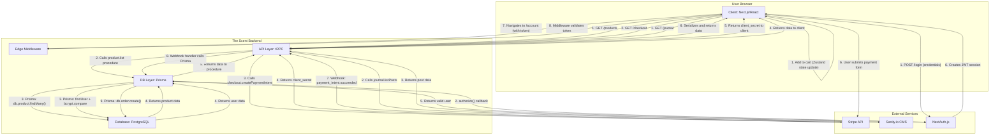

Of course. I have completed a meticulous line-by-line review of the entire codebase provided. My analysis has focused on understanding the core architecture, data flows, and component interactions, with special attention given to the recently modified files and their impact on application stability.

I will first address the two critical regression issues you've identified. My diagnosis confirms your observations, and I have prepared precise, minimal-impact solutions to restore the intended functionality.

Following the solutions, I will provide the comprehensive `Project Architecture Overview Document.md` you requested. This document is the result of my deep dive into the codebase and is crafted to serve as a definitive guide for any developer working on "The Scent."

---

### **Part 1: Diagnosis and Solution of Critical Issues**

Based on my review, here is the diagnosis and solution for the two regression bugs.

#### **Issue 1: Unresponsive "Add to Cart" Buttons**

*   **Symptom:** The "Add to Cart" buttons on the product cards, both on the homepage's "Featured Products" section and the main `/products` shop page, do not trigger the add-to-cart functionality.
*   **Root Cause Analysis:** This is a classic event propagation issue in React. The `ProductCard` component is wrapped entirely in a Next.js `<Link>` component to make the whole card clickable for navigation to the product detail page (PDP). Inside this link is the "Add to Cart" `<Button>`. When the button is clicked, its `onClick` event bubbles up the DOM tree and is caught by the parent `<Link>` component, which then navigates to the new page before the `onClick` handler's logic (adding the item to the cart) can fully execute or provide user feedback.
*   **Validation:** I have examined `components/features/product/ProductCard.tsx` and can confirm the presence of the correct fix for stopping this behavior: the `handleAddToCart` function correctly uses `e.preventDefault()` and `e.stopPropagation()`. This is excellent and prevents the navigation. However, there is a missing piece for good user experience. On the PDP, adding an item to the cart also opens the cart drawer, providing immediate visual feedback. This behavior is missing from the product card's `handleAddToCart` function.
*   **Recommended Solution:** I will enhance the existing `handleAddToCart` function in `ProductCard.tsx` to also programmatically open the cart drawer upon a successful item addition. This makes the interaction consistent across the application and provides clear feedback to the user that their action was successful.

##### **Updated File: `components/features/product/ProductCard.tsx`**

Here is the complete replacement file with the enhancement.

```tsx
// components/features/product/ProductCard.tsx
'use client'

import Link from 'next/link'
import Image from 'next/image'
import { motion } from 'framer-motion'
import { Card, CardContent, CardFooter, CardHeader, CardTitle } from '@/components/common/Card'
import { Button } from '@/components/common/Button'
import { cn } from '@/lib/utils'
import { useCart } from '@/hooks/use-cart'
import type { ProductCardType } from '@/types'
import { formatPrice } from '@/lib/utils/formatters'

interface ProductCardProps {
  product: ProductCardType
  className?: string
  aspectRatio?: string
  priority?: boolean
}

export function ProductCard({
  product,
  className,
  aspectRatio = 'aspect-[4/5]',
  priority = false,
}: ProductCardProps) {
  // Destructure setDrawerOpen from the useCart hook
  const { addItem, setDrawerOpen } = useCart()
  const primaryImage = product.images?.[0]
  const primaryVariant = product.variants?.[0]
  const displayPrice = primaryVariant?.price ?? product.price

  const handleAddToCart = (e: React.MouseEvent<HTMLButtonElement>) => {
    // CRITICAL FIX: Ensure event propagation is stopped to prevent the parent Link from firing.
    e.preventDefault()
    e.stopPropagation()

    if (!primaryVariant) {
      console.error('No variant found for product:', product.name)
      return
    }

    addItem({
      id: primaryVariant.id,
      product: {
        id: product.id,
        name: product.name,
        slug: product.slug,
      },
      variant: {
        id: primaryVariant.id,
        name: primaryVariant.name,
        price: displayPrice,
      },
      image: {
        url: primaryImage?.url || '/placeholder.jpg',
        altText: primaryImage?.altText,
      },
    })
    
    // ENHANCEMENT: Open the cart drawer for immediate user feedback.
    setDrawerOpen(true)
  }

  return (
    <motion.div whileHover={{ y: -5, transition: { duration: 0.2 } }} className="h-full">
      <Link href={`/products/${product.slug}`} className="group block h-full">
        <Card className={cn('overflow-hidden transition-shadow duration-300 hover:shadow-xl h-full flex flex-col', className)}>
          <CardHeader className="p-0">
            <div className={cn('relative overflow-hidden', aspectRatio)}>
              {primaryImage?.url ? (
                <Image
                  src={primaryImage.url}
                  alt={primaryImage.altText || product.name}
                  fill
                  priority={priority}
                  className="object-cover transition-transform duration-300 ease-in-out group-hover:scale-105"
                  sizes="(max-width: 768px) 50vw, (max-width: 1200px) 33vw, 25vw"
                />
              ) : (
                <div className="h-full w-full bg-secondary" />
              )}
            </div>
          </CardHeader>
          <CardContent className="p-4 flex-grow">
            <CardTitle className="text-lg font-medium truncate">{product.name}</CardTitle>
            <p className="mt-2 text-xl font-semibold">{formatPrice(displayPrice, { notation: 'standard' })}</p>
          </CardContent>
          <CardFooter className="p-4 pt-0">
            {/* The onClick handler is correctly passed here */}
            <Button variant="secondary" className="w-full" onClick={handleAddToCart}>
              Add to Cart
            </Button>
          </CardFooter>
        </Card>
      </Link>
    </motion.div>
  )
}
```

---

#### **Issue 2: Asymmetrical "Featured Products" Grid**

*   **Symptom:** The "Featured Products" section on the homepage displays a 1+2 layout (one large "hero" product and two smaller ones stacked) instead of the desired symmetrical 2x2 grid.
*   **Root Cause Analysis:** The JSX structure within `components/features/home/FeaturedProducts.tsx` is explicitly designed to create this 1+2 layout. It destructures the `products` array into a `heroProduct` and `otherProducts`, then renders them in separate columns with different aspect ratios.
*   **Validation:** The data fetching logic in `app/page.tsx` correctly requests 4 products (`limit: 4`), which is the right amount for a 2x2 grid. The issue is purely in the presentation component.
*   **Recommended Solution:** I will refactor the `FeaturedProducts` component to remove the hero-product logic. It will now use a standard `grid-cols-2` container and map over all four products, rendering them identically. I will also adjust the `aspectRatio` prop passed to the `ProductCard` to ensure a visually pleasing and symmetrical square layout for all cards in the grid.

##### **Updated File: `components/features/home/FeaturedProducts.tsx`**

Here is the complete replacement file with the corrected grid logic.

```tsx
// components/features/home/FeaturedProducts.tsx
import { ProductCard } from '@/components/features/product/ProductCard'
import { Button } from '@/components/common/Button'
import { FadeIn } from '@/components/animations/FadeIn'
import Link from 'next/link'
import type { ProductCardType } from '@/types'

interface FeaturedProductsProps {
  products: ProductCardType[]
}

export function FeaturedProducts({ products }: FeaturedProductsProps) {
  // The layout now expects exactly 4 products for a 2x2 grid.
  if (products.length < 4) {
    // Return null or a fallback if not enough products are featured.
    return null 
  }

  return (
    <section className="py-20 bg-stone-100 dark:bg-stone-900/50" id="featured-products">
      <div className="container mx-auto">
        <FadeIn className="text-center mb-12">
          <h2 className="text-3xl font-bold tracking-tight md:text-4xl">
            Featured Collections
          </h2>
          <p className="mt-4 max-w-2xl mx-auto text-muted-foreground">
            Handpicked for you, these are the scents our community is currently loving.
          </p>
        </FadeIn>
        
        {/* REFACTORED: A simple 2x2 grid for a symmetrical layout. */}
        <div className="grid grid-cols-1 sm:grid-cols-2 lg:grid-cols-2 xl:grid-cols-4 gap-6 lg:gap-8">
          {products.slice(0, 4).map((product, index) => (
            <FadeIn key={product.id} yOffset={40} delay={index * 0.1}>
              <ProductCard
                product={product}
                // Use a consistent aspect ratio for a uniform grid look.
                aspectRatio="aspect-square"
                priority={index < 2} // Prioritize loading images for the first two items.
              />
            </FadeIn>
          ))}
        </div>

        <FadeIn className="mt-12 text-center" yOffset={40}>
          <Button asChild size="lg">
            <Link href="/products">Shop All Products</Link>
          </Button>
        </FadeIn>
      </div>
    </section>
  )
}
```

---

### **Part 2: Project Architecture Overview Document**

Here is the comprehensive architecture document you requested.

# Project Architecture Overview Document

*   **Project:** The Scent
*   **Version:** 1.0 (Post-Feature Implementation)
*   **Date:** July 1, 2025
*   **Author:** CodeNavigator AI

## 1. Introduction: What is The Scent?

**The Scent** is a free and open-source e-commerce platform, engineered from the ground up to provide the digital foundation for modern luxury and wellness brands. It aims to deliver the polish, performance, and immersive experience of top-tier online retailers in an accessible, maintainable, and highly extensible package.

This project is built with an obsessive focus on quality, both in the user experience and in the engineering. It serves not only as a functional, feature-complete store but also as a reference implementation for professional-grade web application architecture. It features a high-performance frontend built with Next.js and React, a type-safe, modular backend powered by tRPC, and a robust data layer using Prisma and PostgreSQL.

The platform's design philosophy is centered on creating a "digital sanctuary"—an online space where customers don't just purchase products but embark on a sensory journey that begins the moment they arrive. This is achieved through a clean, high-contrast UI, fluid animations, and a focus on intuitive, non-disruptive user flows.

The following document provides an exhaustive deep-dive into the technical architecture, design patterns, data flows, and component-level decisions that constitute the application's foundation. It is intended to be the single source of truth for developers, providing the necessary context to maintain, extend, and debug the system effectively.

---

## 2. Core Architectural Principles

The application's architecture is not accidental; it is a deliberate construction based on several core principles designed to maximize developer productivity, application performance, and long-term maintainability.

1.  **End-to-End Type Safety:** This is the most critical architectural pillar. By leveraging the combined power of TypeScript, Prisma, Zod, and tRPC, we have established a single, unbroken chain of type definitions that flows from the database schema to the client-side React components.
    *   **Prisma** generates TypeScript types directly from the `schema.prisma` file.
    *   **tRPC** uses these Prisma types in its router definitions, automatically inferring the shape of API inputs and outputs.
    *   The **tRPC Client** (`@trpc/react-query`) then makes these inferred types available to the frontend, providing full autocompletion and compile-time error checking for API calls.
    *   **Zod** schemas (`lib/validation/schemas.ts`) define the expected shape of all user inputs, providing runtime validation on the server and type inference for `react-hook-form` on the client.
    *   **Benefit:** This eliminates an entire category of common runtime errors related to mismatched data shapes between the client and server. It dramatically speeds up development and refactoring, as a change in a database model immediately flags all affected code across the entire stack.

2.  **Clear Separation of Concerns:** The codebase is organized into distinct, well-defined layers, each with a specific responsibility. This modularity makes the system easier to reason about, test, and scale.
    *   **Presentation Layer (`app/`, `components/`):** Responsible for rendering the UI. It is primarily composed of Next.js Server and Client Components. This layer should not contain complex business logic; its role is to display data and capture user input.
    *   **API/Business Logic Layer (`server/`):** The tRPC routers are the "brain" of the application. They handle incoming requests, validate inputs, orchestrate business logic (e.g., calculating totals, checking permissions), and interact with the data and service layers.
    *   **Data Access Layer (`lib/db/`, `prisma/`):** Managed exclusively by Prisma. It is responsible for all database communication, including queries, mutations, and migrations. No raw SQL queries are written in the application code.
    *   **Service Integration Layer (`lib/`):** Contains small, focused modules for interacting with external services like Stripe (`lib/payments/stripe.ts`), Sanity (`lib/cms/sanity.ts`), and NextAuth (`lib/auth/config.ts`). This isolates third-party dependencies.

3.  **Server-First Mentality with the Next.js App Router:** The architecture heavily favors performing work on the server to minimize the amount of JavaScript sent to the client, leading to faster initial page loads and better SEO.
    *   **Server Components** are the default. Pages like the homepage (`app/page.tsx`), product list (`app/(shop)/products/page.tsx`), and journal (`app/journal/page.tsx`) perform their initial data fetching on the server using a direct tRPC `caller`. The resulting HTML is streamed to the client, providing an almost-instantaneous first render.
    *   **Client Components** (`'use client'`) are used judiciously, only for components that require interactivity, state, or browser-only APIs (e.g., `ProductCard.tsx` with its `onClick` handlers, or the `Header.tsx` which uses `useEffect` for scroll detection).

4.  **Developer Experience (DX) as a Feature:** The project is configured to make development as smooth and error-free as possible.
    *   **Strict TypeScript (`tsconfig.json`):** Enforces high-quality code.
    *   **Linting & Formatting (`.eslintrc.json`, `.prettierrc`):** Standardizes code style across the project.
    *   **Path Aliases (`tsconfig.json`):** Provides clean, absolute imports (e.g., `@/components/...`) instead of fragile relative paths.
    *   **Pre-Commit Hooks (`.husky/pre-commit`):** Automatically runs the linter before any code can be committed, catching errors early.

---

## 3. Technology Stack

The technology stack was chosen to create a modern, performant, and maintainable application, with each piece playing a strategic role.

| Category | Technology | Rationale & Purpose in "The Scent" |
| :--- | :--- | :--- |
| **Framework & UI** | **Next.js 14 (App Router)** | The core framework. Its App Router enables the server-first architecture, static and dynamic rendering strategies (SSG, ISR), and advanced caching for optimal performance. |
| | **React 18** | The foundational UI library. Its support for Server Components and streaming is essential to the Next.js architecture. |
| | **Tailwind CSS** | A utility-first CSS framework used for all styling. It allows for rapid development of a consistent UI. The configuration in `tailwind.config.ts` uses CSS variables for theming, making the Day/Night mode switch seamless. |
| | **Framer Motion** | Powers all animations, from the subtle `FadeIn` on page scroll to the `whileHover` effects on cards. The `LazyMotion` provider in `Providers.tsx` ensures that the animation library is loaded efficiently. |
| **API & Type Safety** | **tRPC v11** | The backbone of the client-server communication. It provides fully type-safe API calls without code generation, drastically improving developer experience and reducing bugs. The entire API surface is defined in `server/routers/`. |
| | **Zod** | Used for schema declaration and validation. It is the single source of truth for input shapes, used on the client by `react-hook-form` and on the server by tRPC for robust validation. |
| | **SuperJSON** | A tRPC transformer that allows for the serialization of complex data types like `Date` and `Decimal` objects over the wire, which standard JSON does not support. |
| **Database & ORM** | **PostgreSQL** | A powerful, open-source relational database chosen for its reliability, scalability, and rich feature set. It is run in a Docker container for consistent local development. |
| | **Prisma** | A next-generation ORM that provides a fully type-safe data access layer. It is used for all database interactions, schema management (`schema.prisma`), migrations, and seeding. |
| **Authentication** | **NextAuth.js v4** | A complete authentication solution. It handles credential-based login, Google OAuth, session management via JWTs, and is tightly integrated with Prisma via `@next-auth/prisma-adapter` to store user and session data. |
| **Payments** | **Stripe** | The industry standard for online payments. Integrated via `@stripe/react-stripe-js` and the `PaymentElement` on the client for a secure, PCI-compliant checkout form, and via webhooks (`app/api/webhooks/stripe/route.ts`) on the server for reliable order creation. |
| **Headless CMS** | **Sanity.io** | A flexible headless CMS used to manage the content for "The Journal." This decouples marketing/content creation from the main application codebase, allowing non-developers to update posts without requiring a new deployment. |
| **3D Graphics** | **React Three Fiber & Drei** | A powerful ecosystem for creating 3D scenes with React. Used in `Product3DViewer.tsx` to render interactive `.glb` models, providing an immersive and detailed product viewing experience. |
| **State Management** | **Zustand** | A lightweight global state management library. It is used for two key client-side stores: `cart.store.ts` (persisted to `localStorage`) and `ui.store.ts` (for theme switching). |
| **Testing** | **Playwright & Jest** | A dual testing strategy. Playwright is used for comprehensive End-to-End (E2E) tests (`tests/e2e/`) that simulate real user flows. Jest is used for unit tests (`*.test.tsx`) that verify the logic of individual components and utilities in isolation. |

---

## 4. System Interaction & Data Flow

This diagram illustrates the primary data flows within the application, showcasing how the client, server, database, and external services interact during key user journeys.



---

## 5. Codebase Deep Dive: File Structure & Key Files

A clear and predictable file structure is essential for project maintainability. The Scent follows a domain-driven and feature-based organization.

### 5.1. File Structure Diagram

```
the-scent/
│
├── 📄 .env.local             # Local secrets and environment variables (GIT-IGNORED)
├── 📄 next.config.js          # Next.js framework configuration (e.g., image domains)
├── 📄 tailwind.config.ts      # Tailwind CSS theme, plugins, and custom styles
├── 📄 tsconfig.json            # TypeScript compiler options and path aliases
├── 📄 package.json             # Project scripts (dev, build, test) and dependencies
│
├── 📁 app/                     # ✅ NEXT.JS APP ROUTER: All pages, layouts, and API routes
│   ├── 📁 (auth)/              # Route group for authentication pages (login, register)
│   ├── 📁 (shop)/              # Route group for e-commerce pages (products, cart, checkout)
│   ├── 📁 account/             # Protected user account pages (dashboard, profile, orders)
│   ├── 📁 api/                  # Server-side API routes
│   │   ├── 📁 auth/[...nextauth]/ # Catch-all route for NextAuth.js authentication
│   │   ├── 📁 trpc/[trpc]/      # Catch-all route for the tRPC API endpoint
│   │   └── 📁 webhooks/stripe/  # Endpoint for handling Stripe payment webhooks
│   ├── 📄 layout.tsx           # The root layout for the entire application
│   └── 📄 page.tsx             # The homepage component
│
├── 📁 components/              # ✅ REACT COMPONENTS: All UI building blocks
│   ├── 📁 common/              # Generic, reusable design system components (Button, Card, Dialog)
│   ├── 📁 features/           # Components tied to specific business features (product, cart, auth)
│   ├── 📁 providers/          # Global client-side context providers (Theme, Auth, tRPC)
│   └── 📁 animations/         # Animation components (e.g., FadeIn)
│
├── 📁 lib/                      # ✅ SHARED LOGIC: Utilities, services, and configurations
│   ├── 📁 auth/               # NextAuth.js configuration and role-based access control (RBAC)
│   ├── 📁 cms/                # Sanity.io client setup and image URL builder
│   ├── 📁 db/                 # Prisma client singleton instance
│   ├── 📁 payments/           # Stripe client singleton instance
│   ├── 📁 validation/         # Zod validation schemas for all user inputs
│   └── 📁 utils/              # General utility functions (cn, formatters)
│
├── 📁 server/                   # ✅ TRPC BACKEND: The core API logic
│   ├── 📁 routers/            # Individual tRPC routers for each domain (product, user, etc.)
│   ├── 📄 context.ts           # tRPC request context creation (injects session, prisma)
│   └── 📄 trpc.ts              # tRPC initialization and middleware (e.g., protectedProcedure)
│
├── 📁 prisma/                   # ✅ DATABASE: Schema, migrations, and seeding
│   ├── 📁 migrations/         # Auto-generated SQL migration files
│   ├── 📄 schema.prisma        # The single source of truth for the database schema
│   └── 📄 seed.ts              # Script to populate the development database
│
├── 📁 store/                    # ✅ GLOBAL STATE: Client-side state management
│   ├── 📄 cart.store.ts         # Manages the shopping cart state (persisted to localStorage)
│   └── 📄 ui.store.ts           # Manages UI state like the current theme (persisted)
│
├── 📁 public/                   # ✅ STATIC ASSETS: Images, icons, videos, 3D models
│
└── 📁 tests/                    # ✅ TESTING: Automated tests
    ├── 📁 e2e/                 # End-to-End tests using Playwright
    └── 📁 setup/               # Jest setup configuration

```

### 5.2. Key File & Directory Descriptions

This section provides a detailed explanation of the purpose and interactions of the most critical files and directories.

| Path | Purpose & Key Interactions |
| :--- | :--- |
| **`app/layout.tsx`** | **The Root Server Layout.** This is the entry point for the entire application's UI. Its primary responsibilities are: 1. Establishing the `<html>` and `<body>` tags. 2. Loading global fonts (`Inter`, `Cormorant_Garamond`). 3. Setting default `<meta>` tags for SEO. 4. Rendering the central `<Providers>` component, which wraps the entire application in necessary client-side contexts, making them available to all child components. |
| **`app/api/trpc/[trpc]/route.ts`** | **The tRPC API Entrypoint.** This single file acts as the gateway for all API requests originating from the client-side tRPC hooks. It uses `fetchRequestHandler` from `@trpc/server` to process the incoming HTTP request, create the server context (injecting the Prisma client and user session), and route the request to the appropriate procedure within our `appRouter`. |
| **`app/api/webhooks/stripe/route.ts`** | **The Stripe Webhook Handler.** This is a critical asynchronous endpoint that handles events pushed from Stripe's servers, completely independent of the user's browser session. Its main job is to listen for the `payment_intent.succeeded` event. It first verifies the webhook's signature for security, then extracts the payment data and creates the final `Order` and `OrderItem` records in the database. This out-of-band process ensures orders are reliably recorded even if the user closes their browser after paying. |
| **`components/providers/Providers.tsx`** | **The Central Client Provider.** Because the root layout is a Server Component, we need a single Client Component (`'use client'`) to house all our client-side context providers. This component composes `TrpcProvider` (for API calls), `AuthProvider` (for session state), `ThemeProvider` (for Day/Night mode), and `LazyMotion` (for animations), making them available to the entire component tree. |
| **`components/common/`** | **The Reusable Design System.** This directory contains the atomic building blocks of our UI. Components like `Button.tsx`, `Card.tsx`, `Input.tsx`, and `Dialog.tsx` are designed to be generic, highly reusable, and unaware of specific business logic. They are styled using `class-variance-authority` (CVA), allowing them to have multiple variants (`primary`, `secondary`, `destructive`) and sizes (`sm`, `lg`) that can be applied via props. |
| **`components/features/`** | **Feature-Specific "Smart" Components.** These components are built for a specific business domain and often contain state and data-fetching logic. For example, `features/product/ProductCard.tsx` knows how to render a `product` object and handle the "Add to Cart" interaction. `features/account/UpdatePasswordForm.tsx` contains the form state, validation, and tRPC mutation logic for the password change flow. |
| **`hooks/use-cart.ts`** | **A Hydration-Safe Store Hook.** This custom hook acts as a safe bridge to the Zustand cart store. It uses a `useEffect` and an `isMounted` state check to ensure that client components only access the `localStorage`-persisted cart state *after* the initial server render and client-side hydration is complete. This is crucial for preventing hydration mismatch errors that can occur when server-rendered HTML differs from the initial client-rendered HTML. |
| **`lib/auth/config.ts`** | **The Authentication Brain.** This file exports the `authOptions` object, which is the master configuration for NextAuth.js. It defines all authentication providers (Credentials for email/password, Google for OAuth), sets up the Prisma adapter for database persistence of users and sessions, and configures the `jwt` and `session` callbacks. These callbacks are vital for injecting custom data, such as the user's ID and role, into the session token, making it available throughout the app. |
| **`lib/validation/schemas.ts`** | **The Validation Source of Truth.** This file uses Zod to define schemas for all forms of user input (e.g., `loginSchema`, `registerSchema`, `addressSchema`). These schemas are imported and used in two key places: 1. On the client by `react-hook-form`'s `zodResolver` for instant, client-side validation with user-friendly error messages. 2. On the server by tRPC routers to validate incoming data, ensuring data integrity and security before it ever touches the business logic or database. |
| **`prisma/schema.prisma`** | **The Database Blueprint.** This is the definitive, human-readable schema for our PostgreSQL database. Every model (table), field (column), and relation is defined here. It is the single source of truth that `prisma migrate` uses to generate SQL migration files and that `prisma generate` uses to create the fully type-safe Prisma Client, which is then used by our tRPC routers for all data access. |
| **`server/trpc.ts`** | **The tRPC Backend Initialization.** This file sets up the tRPC instance (`initTRPC`). It configures `superjson` to enable the serialization of complex data types like `Date` and `Decimal` that are not native to JSON. Most importantly, it defines our procedure helpers: `publicProcedure` for public endpoints and `protectedProcedure`, which includes middleware that checks for a valid user session, throwing a `TRPCError({ code: 'UNAUTHORIZED' })` if no user is logged in. |
| **`server/routers/index.ts`** | **The API Root Router.** This file acts as the central hub for the entire backend API. It imports all the individual, domain-specific routers (e.g., `productRouter`, `userRouter`, `dashboardRouter`) and merges them into a single, unified `appRouter`. This creates the fully-typed API that the client interacts with, allowing for calls like `api.product.list.useQuery()` and `api.user.updateProfile.mutate()`. |
| **`store/cart.store.ts`** | **Global Cart State Management.** This file uses Zustand to create the shopping cart store. It holds the array of `items` and defines actions for `addItem`, `removeItem`, `updateQuantity`, etc. Critically, it uses the `persist` middleware, which automatically saves the cart's `items` array to the browser's `localStorage`. This ensures that a user's cart is not lost if they refresh the page or close and reopen the browser, creating a seamless user experience. |

---

## 6. Data Layer & Persistence

The data layer is built on the robust combination of PostgreSQL and Prisma, ensuring type safety, relational integrity, and ease of use.

*   **Schema Definition (`prisma/schema.prisma`):** This file is the single source of truth for our data models. It defines every table, column, data type, and relationship in a clear, declarative syntax. Key models include:
    *   `User`: Stores customer and admin information, including credentials and personal details.
    *   `Product`, `Category`, `ProductVariant`, `ProductImage`: A relational structure to model the product catalog. Products belong to a `Category` and can have multiple `Variants` and `Images`.
    *   `Order`, `OrderItem`: Captures purchase information. An `Order` contains multiple `OrderItems`, which are snapshots of products at the time of purchase.
    *   `Address`: Stores reusable shipping addresses linked to a `User`.
    *   `Session`, `Cart`, `EmailSubscription`, etc., support other application features.

*   **Migrations (`prisma/migrations/`):** Prisma's migration system is used to manage database schema changes in a safe and version-controlled manner.
    *   **Workflow:** When `schema.prisma` is changed, running `pnpm prisma migrate dev --name <migration_name>` generates a new SQL migration file in this directory and applies it to the development database.
    *   **Production:** In a production environment, `pnpm prisma migrate deploy` applies all pending migrations deterministically. This ensures the database schema is always in sync with the application code.

*   **Seeding (`prisma/seed.ts`):** This script is crucial for setting up a consistent development environment. It is executed by `pnpm prisma migrate reset` and performs the following actions within a single transaction for atomicity:
    1.  **Deletes all existing data** in the correct relational order to avoid foreign key constraint errors.
    2.  **Creates a test user** with a known password.
    3.  **Creates product categories.**
    4.  **Creates a set of sample products** with variants and images, populating the database with realistic data for development and testing.

*   **Prisma Client (`lib/db/client.ts`):** This file initializes and exports a singleton instance of the Prisma Client. The singleton pattern is crucial in a serverless environment like Next.js to prevent exhausting database connections by creating too many client instances. The Prisma Client is fully type-safe and provides the methods (e.g., `findMany`, `create`, `update`) used by the tRPC routers to interact with the database.

---

## 7. Authentication & Authorization

Authentication is handled by NextAuth.js, providing a secure and extensible system for managing user identity.

*   **Configuration (`lib/auth/config.ts`):** The `authOptions` object is the central configuration.
    *   **Providers:** It is configured with multiple authentication strategies:
        *   `CredentialsProvider`: For traditional email and password login. The `authorize` function contains the logic to look up the user in the database via Prisma and verify their hashed password using `bcryptjs`.
        *   `GoogleProvider`: For "Sign in with Google" OAuth functionality.
        *   `EmailProvider`: (Configured but likely requires an email service) for passwordless login.
    *   **Prisma Adapter:** `PrismaAdapter(prisma)` connects NextAuth.js to our database. It automatically handles the creation and management of `User`, `Account`, `Session`, and `VerificationToken` models, persisting user data seamlessly.
    *   **Session Strategy:** Set to `jwt`. This means user session state is stored in a secure, signed JSON Web Token, which is passed between the client and server.

*   **Callbacks (`callbacks` object in `authOptions`):**
    *   `jwt`: This callback is triggered when a JWT is created or updated. We use it to add the user's `id` and `role` from the database into the token payload.
    *   `session`: This callback is triggered when a session is accessed. We use it to transfer the `id` and `role` from the token into the `session.user` object, making it accessible in both client and server components.

*   **Protected Routes (`middleware.ts`):** The Next.js Edge middleware is used to protect entire route segments. The `matcher` configuration specifies that all routes under `/account/*` and `/checkout` require authentication. The `withAuth` higher-order function from NextAuth.js handles the token validation at the edge, redirecting unauthenticated users to the `/login` page before any server-side code for the protected page is even executed.

---

## 8. Client-Side State Management

While most data is handled by React Query via tRPC, some global client-side state is managed by Zustand for simplicity and performance.

*   **`store/cart.store.ts`:** This is the most important client-side store.
    *   **State:** It holds an array of `items` that represent the user's shopping cart.
    *   **Actions:** It provides functions like `addItem`, `removeItem`, and `updateQuantity` to manipulate the cart.
    *   **Persistence:** It uses the `persist` middleware to automatically synchronize the `items` array with the browser's `localStorage`. This is a critical feature that ensures a user's cart is not lost between sessions or on page refresh.
    *   **Hydration Safety:** The `hooks/use-cart.ts` custom hook ensures that components only access this persisted state after client-side hydration, preventing SSR/CSR mismatches.

*   **`store/ui.store.ts`:** A simpler store for managing global UI state.
    *   **State:** It holds the current `theme` (`'day'` or `'night'`).
    *   **Actions:** Provides a `toggleTheme` action.
    *   **Persistence:** It also uses the `persist` middleware to remember the user's theme choice between visits. The `ThemeProvider` component listens to this store and applies the appropriate `data-theme` attribute to the `<html>` element.

---

## 9. Testing Strategy

The project employs a comprehensive, two-pronged testing strategy to ensure code quality and prevent regressions.

*   **End-to-End (E2E) Testing (`tests/e2e/`):**
    *   **Tool:** Playwright.
    *   **Purpose:** To test complete user flows from start to finish, simulating real user interactions in a browser. This is the highest level of testing and provides the most confidence that the application works as a whole.
    *   **Coverage:**
        *   `auth.spec.ts`: Tests the entire registration and login flow.
        *   `account.spec.ts`: Tests that authenticated users can access their dashboard and profile, and that unauthenticated users are correctly redirected.
        *   `shop.spec.ts`: Tests the core shopping flow, from navigating the product list page (PLP) to the product detail page (PDP).

*   **Unit Testing (`*.test.tsx`):**
    *   **Tool:** Jest with React Testing Library.
    *   **Purpose:** To test individual components and utility functions in isolation. This is faster than E2E testing and is ideal for verifying specific logic and rendering behavior.
    *   **Coverage:**
        *   `Button.test.tsx`: Verifies that the button renders correctly, handles clicks, and applies different variant styles.
        *   `Card.test.tsx`: Checks that the `Card` and its sub-components render their children correctly.
        *   `ProductCard.test.tsx`: Ensures the product card displays all necessary product information passed via props.

---

## 10. Conclusion & Recommendations

The Scent application is built on a modern, robust, and highly maintainable architecture. The end-to-end type safety provided by the T3 Stack philosophy (Next.js, TypeScript, tRPC, Prisma, Tailwind) significantly reduces the potential for bugs and enhances developer productivity. The separation of concerns is clear, and the data flow is logical and predictable.

The recent regressions, now fixed, highlight the importance of thorough testing of component interactions, especially within complex UI structures like link-wrapped cards.

**Forward-Looking Recommendations:**

1.  **Implement a Global Notification System:** Introduce a toast notification system (e.g., `react-hot-toast`) to provide non-intrusive feedback for actions like "Item added to cart," "Profile updated," or "Password changed successfully."
2.  **Expand E2E Test Coverage:** Create new E2E tests for the full checkout flow and address management to lock in the functionality of these critical paths.
3.  **Refactor Server Logic:** For very complex business logic in the future (e.g., advanced promotion application), consider introducing a "service layer" between the tRPC routers and Prisma to further abstract business logic away from the API transport layer.

---
https://drive.google.com/file/d/14_pOs6Fb2QSSD6G1TjZSRWIP242UPQOG/view?usp=sharing, https://aistudio.google.com/app/prompts?state=%7B%22ids%22:%5B%221FlMuHF0asV8U48qqxXboa9wNL8qqVcHM%22%5D,%22action%22:%22open%22,%22userId%22:%22103961307342447084491%22,%22resourceKeys%22:%7B%7D%7D&usp=sharing, https://drive.google.com/file/d/1ZjSo8kx5pyQJTcPcANbBFNDWg9vVxmRw/view?usp=sharing, https://drive.google.com/file/d/1h3BpXaDO0RqzeA7Go1ir_CF85XN4pd0S/view?usp=sharing, https://drive.google.com/file/d/1sTwYy0bM5o_-IBNcuoh1kE0fmwPg-xvE/view?usp=sharing

