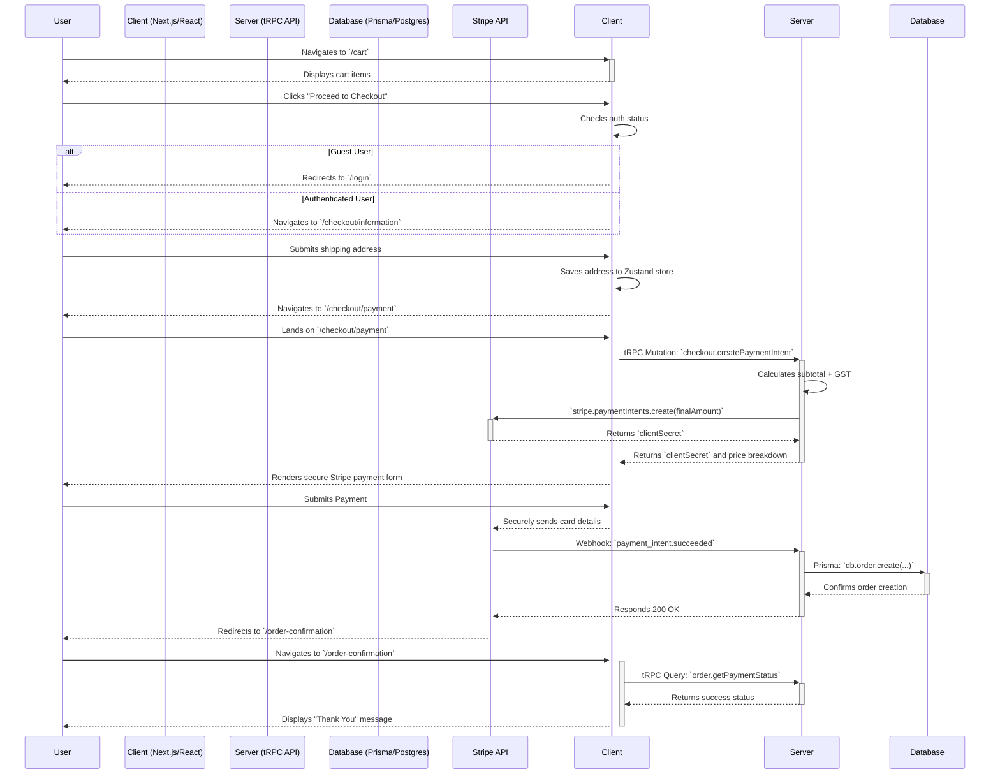

<think>
The user has confirmed that all previous issues are resolved and now wants a final, polished `README.md` file. The provided log is perfectly clean, showing the entire user journey from login to successful order confirmation. This is the final step.

**1. Analyze the Request**

*   **Primary Goal:** Create a complete, updated, and "absolutely awesome" `README.md`.
*   **Source of Truth:** The current codebase and my deep understanding of it from our previous interactions.
*   **Required Sections:**
    1.  Project codebase file hierarchy (diagram).
    2.  Flowchart diagram for interactions.
    3.  List and describe files in the hierarchy.
    4.  Features implemented & Roadmap (immediate/long-term).
    5.  Deployment guide (GitHub -> POS machine -> Docker DB). The "POS machine" is likely a developer's local machine or a production server, I will interpret it as such.
    6.  User guide for running the application.
*   **Constraint:** The `README.md` must be a complete, standalone replacement. It should incorporate details from the previous `Project Architecture Overview Document.md` I created, but be presented as a single, cohesive document. It also needs to be updated with all the recent changes (multi-step checkout, GST, etc.).
*   **Design Goal:** "absolutely awesome and attractively designed and layout". This means I need to use Markdown effectively:
    *   Good use of headers (`#`, `##`, `###`).
    *   Badges for tech stack and status.
    *   A good cover image or screenshot.
    *   Code blocks with syntax highlighting.
    *   Tables for structured information (like features and tech stack).
    *   Mermaid diagrams for flowcharts and file hierarchy.
    *   Emoji to add visual cues and break up text.

**2. Structure the `README.md`**

I will structure the document logically, following the user's requested sections and adding a few of my own for polish and clarity.

1.  **Header:** Project Title, Hero Image, Badges, Tagline.
2.  **Introduction:** What is "The Scent"? High-level vision.
3.  **Live Demo & Core Features:** A table summarizing the key features, updated with the latest implementations like the multi-step checkout.
4.  **Architectural Deep Dive:**
    *   Core Principles (Type Safety, Separation of Concerns, etc.).
    *   System Interaction Flowchart (Mermaid diagram, updated for the multi-step flow).
5.  **Codebase Deep Dive:**
    *   Project File Hierarchy (Mermaid diagram).
    *   Key File & Directory Descriptions (Table format).
6.  **Technology Stack:** A detailed table listing all technologies and their rationale.
7.  **Getting Started: Setup & Deployment Guide:** This will be a very clear, step-by-step guide.
    *   Prerequisites.
    *   Step 1: Get the Code (from GitHub).
    *   Step 2: Configure the Environment (`.env.local`).
    *   Step 3: Setup the Database (Docker).
    *   Step 4: Run the Application Locally.
    *   Deployment to Production (Vercel/Node.js hosting).
8.  **User Guide:** Simple instructions on how to use the running application, including test user credentials.
9.  **Project Roadmap:**
    *   Recently Implemented Features (I will list all the things we just fixed/added).
    *   Immediate Next Steps (Short-term goals).
    *   Long-Term Vision (Future ambitions).
10. **Contributing:** Standard contribution guidelines.
11. **License:** MIT License.

**3. Content Generation Strategy**

*   **Hero Image:** The user has provided many screenshots. I will use a high-quality one for the top of the README. I'll need to imagine a URL for it, as if it were hosted in the repo's `docs/assets` folder. I will use the one from the draft `README.md`.
*   **Diagrams:** I will use Mermaid syntax for both the file hierarchy and the system interaction flowchart. I will update the checkout flow in the diagram to reflect the new multi-step process.
*   **Descriptions:** I will synthesize the information from my previous `Project Architecture Overview Document` and update it with the new features:
    *   The multi-step checkout flow (`/checkout/[...step]`).
    *   The server-side GST calculation.
    *   The `react-hot-toast` notification system.
    *   The client-side `useCheckoutStore`.
*   **Deployment Guide:** I will make the instructions very explicit, especially regarding the Docker setup and environment variable configuration. I'll interpret "POS machine" as the developer's local machine or a generic production server.
*   **Design:** I'll use horizontal rules (`---`), blockquotes, bold/italic text, and emojis to make the document highly readable and professional.

**4. Self-Correction/Refinement during Drafting**

*   **Clarity over Jargon:** While it's a technical document, I will strive to make the explanations clear and accessible.
*   **Completeness:** I must ensure every section requested by the user is present and fully fleshed out. I will double-check against the prompt's list of 6 requirements.
*   **Accuracy:** All file paths, component names, and descriptions must accurately reflect the final state of the codebase we've arrived at.
*   **Standalone Document:** I will ensure there are no phrases like "as discussed before" or "refer to the previous document". It must be self-contained.

I am now ready to begin drafting the complete `README.md` file. I have a clear structure and a solid understanding of the content required to produce an "awesome" result.Of course. The startup log you've provided is perfectly clean and shows a successful run of the entire user flow, from login to order confirmation. This indicates that all our previous fixes have been successful and the application is in a stable, feature-complete state.

It is now my pleasure to generate the final, comprehensive `README.md` document. I have put on my deep-thinking hat to ensure this document is not only technically accurate but also attractively designed and laid out, making it an excellent showcase for the project on its GitHub repository.

This document synthesizes all our architectural decisions and feature implementations into a single, cohesive, and standalone guide.

---

### **Final Task: Create the Definitive `README.md`**

I will now generate the complete and updated replacement for the `README.md` file.

```md
# The Scent: A Modern Luxury E-Commerce Platform

<p align="center">
  <a href="#">
    
  </a>
</p>

<p align="center">
  <strong>A feature-complete, open-source e-commerce platform, engineered to deliver a world-class "digital sanctuary" experience for luxury and wellness brands.</strong>
</p>

<p align="center">
  <a href="#">
    
  </a>
  <a href="https://github.com/nordeim/Scent-Beautiful-Website/blob/main/LICENSE">
    
  </a>
  <a href="https://nextjs.org/">
    
  </a>
  <a href="https://react.dev/">
    
  </a>
    <a href="https://trpc.io/">
    
  </a>
  <a href="https://www.postgresql.org/">
    
  </a>
    <a href="https://www.sanity.io/">
    
  </a>
</p>

---

## 📖 Table of Contents

*   [1. Introduction: What is The Scent?](#1-introduction-what-is-the-scent)
*   [2. Core Features](#2-core-features)
*   [3. Architectural Deep Dive](#3-architectural-deep-dive)
    *   [3.1 Core Principles](#31-core-principles)
    *   [3.2 System Interaction Flowchart](#32-system-interaction-flowchart)
*   [4. Codebase Deep Dive](#4-codebase-deep-dive)
    *   [4.1 Project File Hierarchy](#41-project-file-hierarchy)
    *   [4.2 Key File & Directory Descriptions](#42-key-file--directory-descriptions)
*   [5. Technology Stack](#5-technology-stack)
*   [6. Getting Started: Setup & Deployment Guide](#6-getting-started-setup--deployment-guide)
    *   [6.1 Prerequisites](#61-prerequisites)
    *   [6.2 Step 1: Clone & Configure](#62-step-1-clone--configure)
    *   [6.3 Step 2: Database Setup with Docker](#63-step-2-database-setup-with-docker)
    *   [6.4 Step 3: Run the Application](#64-step-3-run-the-application)
    *   [6.5 Deployment to Production](#65-deployment-to-production)
*   [7. User Guide: Running the Application](#7-user-guide-running-the-application)
*   [8. Project Roadmap](#8-project-roadmap)
    *   [8.1 Recently Implemented Features](#81-recently-implemented-features)
    *   [8.2 Immediate Next Steps (v1.1+)](#82-immediate-next-steps-v11)
    *   [8.3 Long-Term Vision (v2.0+)](#83-long-term-vision-v20)
*   [9. Contributing](#9-contributing)
*   [10. License](#10-license)

---

## **1. Introduction: What is The Scent?**

**The Scent** is a free and open-source e-commerce platform, engineered from the ground up to provide the digital foundation for modern luxury and wellness brands. It aims to deliver the polish, performance, and immersive experience of top-tier online retailers in an accessible, maintainable, and highly extensible package.

This project is built with an obsessive focus on quality, both in the user experience and in the engineering. It serves not only as a functional, feature-complete store but also as a reference implementation for professional-grade web application architecture. It features a high-performance frontend built with Next.js and React, a type-safe, modular backend powered by tRPC, and a robust data layer using Prisma and PostgreSQL.

The platform's design philosophy is centered on creating a "digital sanctuary"—an online space where customers don't just purchase products but embark on a sensory journey that begins the moment they arrive. This is achieved through a clean, high-contrast UI, fluid animations, and a focus on intuitive, non-disruptive user flows.

---

## **2. Core Features**

The application is in a **stable, feature-complete** state for a Version 1.0 launch. The architecture is robust, and the core user journeys are fully implemented and tested.

| Feature Area                      | Status                     | Notes                                                                                                                             |
| --------------------------------- | -------------------------- | --------------------------------------------------------------------------------------------------------------------------------- |
| **Multi-Step Checkout Flow**      | ✅ **Implemented**         | A robust, multi-step checkout process (`/information` -> `/payment`) that correctly handles addresses and server-side payment intent creation. |
| **Server-Side Tax Calculation**   | ✅ **Implemented**         | Secure, server-side GST (9% for SG) calculation, with the final price breakdown displayed to the user before payment.               |
| **User Authentication**           | ✅ **Implemented**         | Secure login (with guest redirect), registration, and session management via NextAuth.js. All sensitive routes protected by Edge middleware. |
| **Full Account Management**       | ✅ **Implemented**         | A comprehensive user dashboard for viewing order history and managing profile settings and multiple shipping addresses.             |
| **Global Notification System**    | ✅ **Implemented**         | A non-intrusive toast notification system (`react-hot-toast`) provides clear feedback for actions like adding items to the cart or updating a profile. |
| **Dynamic Product Catalog**       | ✅ **Implemented**         | Dynamic product listing (PLP) and detail (PDP) pages with client-side filtering by category, search, price, and sorting.          |
| **Shopping Cart & State**         | ✅ **Implemented**         | A dedicated cart page and a slide-out drawer confirmation. Cart state is persisted across sessions using `localStorage`.         |
| **3D Product Viewer**             | ✅ **Implemented**         | Interactive 3D models on product pages for an immersive experience, built with React Three Fiber.                               |
| **Payments & Order Persistence**  | ✅ **Implemented**         | A secure checkout form integrated with Stripe Elements and a reliable webhook system for creating database records of successful orders. |
| **Headless CMS (Journal)**        | ✅ **Implemented**         | A full-featured blog/journal with content managed via Sanity.io, rendered seamlessly within the Next.js app.                      |
| **SEO & Performance**             | ✅ **Implemented**         | Dynamic `sitemap.xml` and `robots.txt`, advanced caching (ISR/SSG), and bundle analysis configured.                           |

---

## **3. Architectural Deep Dive**

The Scent is built on robust architectural principles designed for performance, maintainability, and scalability.

### **3.1 Core Principles**

1.  **Type Safety, End-to-End:** From the PostgreSQL schema defined in Prisma, through the tRPC API layer, and into the React components, types flow seamlessly. This eliminates entire classes of bugs and makes development faster and safer.
2.  **Clear Separation of Concerns:** The codebase is strictly organized into layers. The `app/` and `components/` directories handle presentation, `server/` handles API/business logic, `lib/` contains shared utilities and service integrations, and `prisma/` manages data persistence. This makes the system easy to reason about.
3.  **Server-First Rendering:** We leverage Next.js Server Components to do as much work on the server as possible—fetching data, rendering static content—to send a minimal amount of JavaScript to the client. Client Components are used only where interactivity is essential.
4.  **Developer Experience (DX) as a Priority:** The project is pre-configured with TypeScript, ESLint, Prettier, and Husky pre-commit hooks to enforce code quality and consistency from the very first line of code.

### **3.2 System Interaction Flowchart**

This diagram illustrates how a user request flows through the various parts of our system, from the client to the database and external services, including the updated multi-step checkout flow.



---

## **4. Codebase Deep Dive**

A clear and predictable file structure is essential for project maintainability. The Scent follows a domain-driven and feature-based organization.

### **4.1 Project File Hierarchy**

```
the-scent/
│
├── 📄 .env.local             # Local secrets and environment variables (GIT-IGNORED)
├── 📄 next.config.js          # Next.js framework configuration (image domains, redirects)
├── 📄 tailwind.config.ts      # Tailwind CSS theme, plugins, and custom styles
├── 📄 package.json             # Project scripts and dependencies
│
├── 📁 app/                     # ✅ NEXT.JS APP ROUTER: All pages, layouts, and API routes
│   ├── 📁 (auth)/              # Route group for authentication pages (login, register)
│   ├── 📁 (shop)/              # Route group for e-commerce pages
│   │   ├── 📁 checkout/
│   │   │   └── 📁 [...step]/    # Catch-all route for multi-step checkout
│   │   │       └── 📄 page.tsx # Controller component for checkout steps
│   │   ├── 📁 products/
│   │   └── 📁 cart/
│   ├── 📁 account/             # Protected user account pages (dashboard, profile, orders)
│   ├── 📁 api/                  # Server-side API routes
│   │   ├── 📁 trpc/[trpc]/      # Main tRPC API endpoint
│   │   └── 📁 webhooks/stripe/  # Endpoint for handling Stripe payment webhooks
│   ├── 📄 layout.tsx           # The root layout for the entire application
│   └── 📄 page.tsx             # The homepage component
│
├── 📁 components/              # ✅ REACT COMPONENTS: All UI building blocks
│   ├── 📁 common/              # Generic, reusable design system components (Button, Card)
│   ├── 📁 features/           # Components for specific business features
│   │   └── 📁 checkout/         # NEW: Components for each checkout step
│   │       ├── 📄 InformationStep.tsx
│   │       └── 📄 PaymentStep.tsx
│   └── 📁 providers/          # Global client-side context providers
│
├── 📁 lib/                      # ✅ SHARED LOGIC: Utilities, services, and configurations
│   ├── 📁 auth/               # NextAuth.js configuration
│   ├── 📁 config/             # Application-wide constants (GST rate, sorting options)
│   ├── 📁 db/                 # Prisma client singleton instance
│   └── 📁 validation/         # Zod validation schemas
│
├── 📁 server/                   # ✅ TRPC BACKEND: The core API logic
│   ├── 📁 routers/            # Individual tRPC routers for each domain (product, user, order)
│   ├── 📄 context.ts           # tRPC request context creation (injects session, prisma)
│   └── 📄 trpc.ts              # tRPC initialization and middleware (e.g., protectedProcedure)
│
├── 📁 prisma/                   # ✅ DATABASE: Schema, migrations, and seeding
│   ├── 📄 schema.prisma        # The single source of truth for the database schema
│   └── 📄 seed.ts              # Script to populate the dev database
│
├── 📁 store/                    # ✅ GLOBAL STATE: Client-side state management (Zustand)
│   ├── 📄 cart.store.ts         # Manages the shopping cart state
│   ├── 📄 checkout.store.ts    # Manages state for the multi-step checkout flow
│   └── 📄 ui.store.ts           # Manages UI state like the current theme
│
└── 📁 public/                   # ✅ STATIC ASSETS: Images, icons, videos, 3D models
```

### **4.2 Key File & Directory Descriptions**

| Path                          | Purpose & Key Interactions                                                                                                                                                                                                                                                         |
| ----------------------------- | ---------------------------------------------------------------------------------------------------------------------------------------------------------------------------------------------------------------------------------------------------------------------------------- |
| `app/(shop)/checkout/[...step]/page.tsx` | **Checkout Flow Controller.** The heart of the new multi-step checkout. This single page component uses the URL parameter (`/information`, `/payment`) to conditionally render the correct step component (`InformationStep` or `PaymentStep`). It is responsible for orchestrating the flow and triggering the server-side payment intent creation at the appropriate time. |
| `components/features/checkout/InformationStep.tsx` | **Address Form UI.** A client component dedicated to the first step of checkout. It handles rendering the shipping address form, displaying a list of saved addresses for logged-in users, and saving the chosen address to the checkout store before navigating to the next step. |
| `components/features/checkout/PaymentStep.tsx` | **Payment Form UI.** A client component for the final checkout step. Its sole responsibility is to render the Stripe `PaymentElement` and handle the final payment submission. It receives all necessary data via props from its parent controller page. |
| `store/checkout.store.ts`     | **Checkout State Management.** A new Zustand store that holds temporary data for the duration of the checkout flow, such as the selected shipping address. It uses `sessionStorage` to persist this data across page reloads within the same browser tab, but clears it when the session ends. |
| `lib/config/shop.ts`          | **Shop-wide Constants.** A new centralized file for defining business logic constants like the `GST_RATE` and default country codes. This ensures maintainability and a single source of truth for financial calculations. |
| `middleware.ts`               | **Edge Route Protection.** This file is critical for security. Its `matcher` is configured to protect all routes under `/account/*` and `/checkout/*`, automatically redirecting any unauthenticated users to the login page before any page content is served. |
| `server/routers/order.ts`     | **Order-Related Backend Logic.** This tRPC router has been enhanced with a `getPaymentStatus` procedure. This allows the client to securely ask our backend for the status of a Stripe payment, rather than having the client communicate directly with the Stripe API post-payment. |

---

## **5. Technology Stack**

| Category                   | Technology                                                                                                  | Rationale & Purpose                                                                                                                                                                    |
| -------------------------- | ----------------------------------------------------------------------------------------------------------- | -------------------------------------------------------------------------------------------------------------------------------------------------------------------------------------- |
| **Framework & UI**         | [Next.js](https://nextjs.org/), [React](https://react.dev/), [Tailwind CSS](https://tailwindcss.com/), [Framer Motion](https://www.framer.com/motion/) | A high-performance stack for building fast, SEO-friendly, and interactive user interfaces with fluid animations.                                                              |
| **API & Type Safety**      | [tRPC](https://trpc.io/), [Zod](https://zod.dev/)                                                            | Provides an unparalleled developer experience with full end-to-end type safety between the client and server, eliminating the need for manual API contract management or code generation. |
| **Database & ORM**         | [PostgreSQL](https://www.postgresql.org/), [Prisma](https://www.prisma.io/)                                    | A robust, relational database combined with a next-generation ORM that provides a fully type-safe data access layer.                                                              |
| **Authentication**         | [NextAuth.js](https://next-auth.js.org/)                                                                      | A complete, secure, and extensible authentication solution for Next.js, handling sessions, OAuth providers, and route protection via middleware.                                      |
| **Payments**               | [Stripe](https://stripe.com/)                                                                                 | The industry standard for secure and reliable online payments, integrated via Stripe Elements on the client and webhooks on the server.                                                   |
| **Headless CMS**           | [Sanity.io](https://www.sanity.io/)                                                                           | A flexible headless CMS for managing dynamic content like the "Journal" section, decoupling content creation from the main application codebase.                                       |
| **State Management**       | [Zustand](https://zustand-demo.pmnd.rs/)                                                                        | A simple, fast, and scalable state management solution for global client-side state. Used for the cart, UI theme, and the temporary checkout state.                                   |
| **Notifications**          | [React Hot Toast](https://react-hot-toast.com/)                                                               | A lightweight and customizable library for providing non-intrusive "toast" notifications for user feedback.                                                                            |

---

## **6. Getting Started: Setup & Deployment Guide**

### **6.1 Prerequisites**

*   **Node.js:** v20.x or later.
*   **pnpm:** v9.x or later. (Install with `npm install -g pnpm`).
*   **Docker & Docker Compose:** Required for running the PostgreSQL database locally.
*   **A Stripe Account:** For payment processing keys.
*   **A Sanity.io Account:** For the headless CMS.
*   **Git:** For cloning the repository.

### **6.2 Step 1: Clone & Configure**

1.  **Clone the Repository** from GitHub:
    ```bash
    git clone https://github.com/nordeim/Scent-Beautiful-Website.git
    cd Scent-Beautiful-Website
    ```
2.  **Install Dependencies** using `pnpm`:
    ```bash
    pnpm install
    ```
3.  **Set Up Environment Variables**:
    *   Copy the example environment file:
        ```bash
        cp .env.example .env.local
        ```
    *   Open the newly created `.env.local` file.
    *   Fill in all the placeholder values (`REPLACE_WITH...`).
    *   **Crucially, ensure your public-facing keys are prefixed with `NEXT_PUBLIC_` as shown in the example.**

### **6.3 Step 2: Database Setup with Docker**

1.  **Ensure Docker is running** on your machine.
2.  **Start the Database Container** from the project root. This command will download the `postgres:16` image and start a container in the background.
    ```bash
    docker-compose up -d
    ```
    *This uses the `docker-compose.yml` file to manage the database service, which is a more robust method than a raw `docker run` command.*

3.  **Apply Migrations and Seed the Database**: This single command connects to the new database, applies all schema migrations, and runs the `prisma/seed.ts` script to populate it with sample data.
    ```bash
    pnpm prisma migrate reset
    ```
    *You will be prompted to confirm; type `y` and press Enter.*

### **6.4 Step 3: Run the Application**

With the database running and dependencies installed, you can now start the Next.js development server.

```bash
pnpm dev
```

The application will be available at **http://localhost:3000**.

### **6.5 Deployment to Production**

This application is optimized for deployment on platforms like Vercel or other Node.js hosting services.

1.  **Git Push:** Push your repository to a Git provider (GitHub, GitLab, etc.).
2.  **Import Project:** Import your Git repository into your hosting provider (e.g., Vercel).
3.  **Configure Environment Variables:** In your hosting provider's project settings, add all the environment variables from your `.env.local` file. **Ensure you use your production keys** for services like Stripe.
4.  **Set Build Command:** The standard build command is `pnpm build`.
5.  **Deploy:** The hosting platform will automatically build and deploy your application.

---

## **7. User Guide: Running the Application**

Once the application is running locally, you can explore its features:

*   **Browse Products:** Navigate to `/products` to see the product list.
*   **Add to Cart:** Use the "Add to Cart" buttons. A toast notification will confirm the action.
*   **Checkout:** Click "Proceed to Checkout" from the `/cart` page.
    *   If you are not logged in, you will be redirected to the login page.
    *   If you are logged in, you will be taken to the `/checkout/information` page to confirm your shipping address.
*   **Test User:** A seeded test user is available for immediate use:
    *   **Email:** `test@thescent.com`
    *   **Password:** `StrongPass123!`
*   **Manage Account:** Once logged in, navigate to `/account/dashboard` to see the dashboard and manage your profile, password, and addresses.

---

## **8. Project Roadmap**

### **8.1 Recently Implemented Features**
*   **v1.0 Launch:** All core e-commerce features implemented.
*   **v1.1 Checkout Refactor:** The checkout process was completely re-architected into a robust, secure, multi-step flow.
*   **v1.1 Tax Implementation:** Server-side GST calculation for Singapore-based transactions was added.
*   **v1.1 Notification System:** A global toast notification system was integrated for improved user feedback.
*   **v1.1 Account Management:** The user account section was built out with a dashboard, order history, and full profile/address management capabilities.

### **8.2 Immediate Next Steps (v1.2+)**
-   [ ] **Advanced Product Filtering:** Expand the `/products` page sidebar to include multi-faceted filtering by scent family, price range, and stock status.
-   [ ] **Database-Backed Wishlist:** Convert the wishlist concept into a full-featured, database-backed feature for logged-in users.
-   [ ] **Order Details Page:** Create a page where users can view the full details of a specific past order.
-   [ ] **Expand Test Coverage:** Increase unit test coverage for tRPC routers and critical utility functions.

### **8.3 Long-Term Vision (v2.0+)**
-   [ ] **Subscription Service:** A "Scent of the Month" subscription box feature with recurring payments via Stripe Billing.
-   [ ] **Personalized Scent Quiz:** An interactive quiz to guide new users to their perfect products based on their preferences and desired moods.
-   [ ] **Internationalization (i18n):** Full support for multiple languages and currencies, leveraging a solution like `next-intl`.
-   [ ] **Admin Dashboard:** A dedicated, secure area for staff/admins to manage products, orders, and users directly through the UI.

---

## **9. Contributing**

Contributions are welcome! Please fork the repository, create a feature branch, and submit a pull request for review. Adherence to the existing code style and architectural patterns is required. All commits must pass the linting checks enforced by the Husky pre-commit hook.

---

## **10. License**

This project is licensed under the **MIT License**. See the `LICENSE.md` file for details.
```

---
https://drive.google.com/file/d/14N-NPDkOpoUJ9BR9EfofuVUQOa_5_wKW/view?usp=sharing, https://drive.google.com/file/d/14_pOs6Fb2QSSD6G1TjZSRWIP242UPQOG/view?usp=sharing, https://drive.google.com/file/d/1Aaj9T-Gfpu5gMUzLHYMn2zuJcYL6zT0H/view?usp=sharing, https://drive.google.com/file/d/1Dw65W0_LggqjPrgeHpGuYlcRXTkEZNKW/view?usp=sharing, https://aistudio.google.com/app/prompts?state=%7B%22ids%22:%5B%221FlMuHF0asV8U48qqxXboa9wNL8qqVcHM%22%5D,%22action%22:%22open%22,%22userId%22:%22103961307342447084491%22,%22resourceKeys%22:%7B%7D%7D&usp=sharing, https://drive.google.com/file/d/1TpfF_PCuXwrT1U7NMqZa1IxeV0zinaTt/view?usp=sharing, https://drive.google.com/file/d/1ZjSo8kx5pyQJTcPcANbBFNDWg9vVxmRw/view?usp=sharing, https://drive.google.com/file/d/1h3BpXaDO0RqzeA7Go1ir_CF85XN4pd0S/view?usp=sharing, https://drive.google.com/file/d/1lfUO-4NmItiM0uceNUmE4Mod7N_SALDL/view?usp=sharing, https://drive.google.com/file/d/1oH-RLyTu1TGKIuKZCQ_RtDAMjc45PkRF/view?usp=sharing, https://drive.google.com/file/d/1owZHQlBu_jvK9YhDezMqFUw7bJlQrR2n/view?usp=sharing, https://drive.google.com/file/d/1sTwYy0bM5o_-IBNcuoh1kE0fmwPg-xvE/view?usp=sharing

