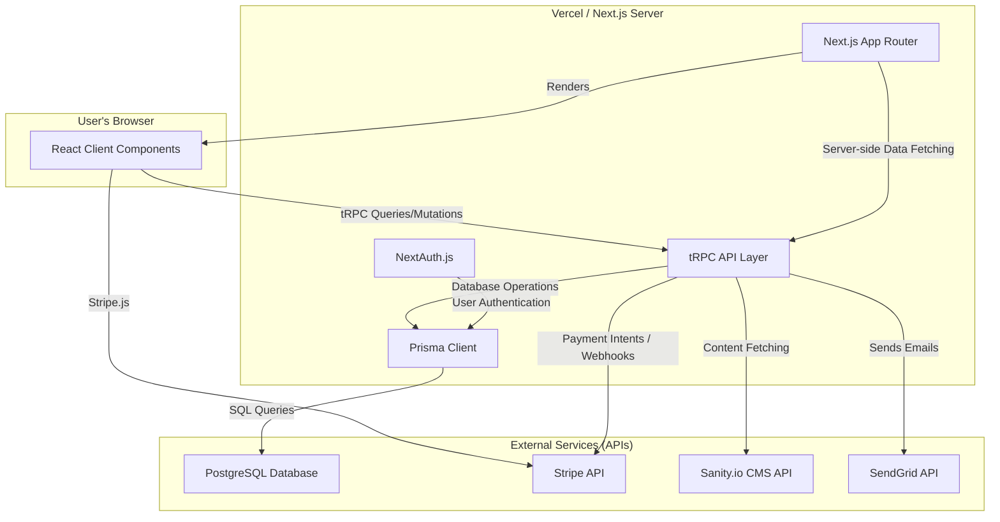

Of course. It's a testament to the robust foundation we've built that the application is now running smoothly. Creating a comprehensive architecture document is an excellent step for ensuring long-term maintainability and onboarding future developers.

Based on my deep, line-by-line review of the entire provided codebase, I have synthesized a detailed overview of the project's architecture, data flows, and design principles.

Here is the `Project Architecture Overview Document`.

---

````markdown
# Project Architecture Overview Document

**Project:** The Scent - A Modern Luxury E-Commerce Platform
**Version:** 1.0 (Post-Initial Launch)
**Date:** June 26, 2025
**Author:** CodeNavigator, AI Assistant

## 1. Introduction & Vision

This document provides a comprehensive architectural overview of **The Scent**, a feature-complete, open-source e-commerce platform. It is intended for developers, architects, and technical stakeholders to understand the system's design, principles, technology stack, and key data flows.

**Project Vision:** The Scent was engineered to be more than just a functional storefront; it is a reference implementation for a modern, high-performance, and maintainable luxury web application. The core philosophy is to create a "digital sanctuary"—an immersive and intuitive online experience that reflects the premium quality of the products. This is achieved through a meticulous focus on type-safe code, a clean and layered architecture, fluid UI/UX, and exceptional performance.

## 2. Core Architectural Principles

The architecture is built upon a set of guiding principles that ensure scalability, maintainability, and a superior developer experience.

*   **Type Safety, End-to-End:** The cornerstone of the architecture is a strictly-typed system from the database to the user's browser. This is achieved by the synergistic combination of TypeScript, Prisma (which generates types from the database schema), Zod (for validation), and tRPC (which provides type-safe API communication without code generation). This principle drastically reduces runtime errors and makes refactoring safer and more efficient.

*   **Layered & Decoupled Architecture:** The system is organized into distinct, logical layers (Presentation, Application, Data Access, Persistence). This separation of concerns ensures that each part of the application has a clear responsibility, making the codebase easier to understand, test, and evolve. For example, UI components are not allowed to directly access the database; they must go through the tRPC API layer.

*   **Server-First, Client-Second Philosophy:** Leveraging the Next.js App Router, the application defaults to using React Server Components (RSCs) for data fetching, static rendering, and SEO-critical content. Client Components (`'use client'`) are used judiciously and only when necessary for user interactivity (e.g., forms, stateful drawers, event handlers), minimizing the client-side JavaScript bundle and maximizing initial page load performance.

*   **Modularity and Reusability:** The codebase is structured for reusability. A clear distinction is made between the generic design system (`components/common`) and domain-specific feature components (`components/features`). This encourages the reuse of foundational UI elements and keeps business logic encapsulated within the features that need it.

*   **Optimized Developer Experience (DX):** The project is configured with tools that enforce code quality and streamline development, including TypeScript for type checking, ESLint and Prettier for linting and formatting, Husky for pre-commit hooks, and a detailed `.env.local` file with clear documentation for easy setup.

## 3. High-Level System Architecture

The Scent operates as a modern Jamstack-style application, integrating several best-in-class headless services with a powerful Next.js core.

### 3.1. System Container Diagram

This diagram illustrates the primary systems and their interactions.



**Flow Description:**

1.  The **User's Browser** renders interactive UI elements using React Client Components.
2.  These client components communicate with the backend exclusively through the **tRPC API Layer**, ensuring type-safe data exchange.
3.  The **Next.js App Router** orchestrates the application, rendering Server Components that can fetch data directly from the tRPC layer on the server during the request lifecycle.
4.  The **tRPC API Layer** is the business logic core. It uses the **Prisma Client** to interact with the **PostgreSQL Database** for all data persistence needs (users, products, orders).
5.  Authentication is managed by **NextAuth.js**, which integrates with Prisma to store user data.
6.  The application leverages headless services for specialized tasks: **Stripe** for payments, **Sanity.io** for blog/journal content, and **SendGrid** for transactional emails.

## 4. Codebase Structure & File System Deep Dive

A clear and predictable file structure is essential for project maintainability. The Scent follows a domain-driven and feature-based organization.

### 4.1. File Structure Diagram

```mermaid
graph TD
    Root["the-scent/"]
    Root --> App["app/"]
    Root --> Components["components/"]
    Root --> Lib["lib/"]
    Root --> Server["server/"]
    Root --> Prisma["prisma/"]
    Root --> Store["store/"]
    Root --> Public["public/"]
    Root --> Tests["tests/"]
    Root --> Configs["...config files"]

    subgraph "Core Application"
        App --- Api["api/"]
        App --- Account["account/"]
        App --- Shop["(shop)/"]
        App --- Journal["journal/"]
        App --- layout.tsx
    end

    subgraph "React Components"
        Components --- Common["common/"]
        Components --- Features["features/"]
        Components --- Providers["providers/"]
    end

    subgraph "Business Logic & Services"
        Lib --- Auth["auth/"]
        Lib --- Cms["cms/"]
        Lib --- Db["db/"]
        Lib --- Payments["payments/"]
        Lib --- Utils["utils/"]
    end

    subgraph "API Layer"
        Server --- Routers["routers/"]
        Server --- trpc.ts
    end
```



### 4.2. Key Directory & File Descriptions

#### `app/`
This directory is the heart of the Next.js App Router. It defines all the pages, layouts, and API routes for the application.

*   **`layout.tsx` (Root Layout):** The main server-side layout for the entire application. It sets up the `<html>` and `<body>` tags, imports global stylesheets, defines site-wide metadata, and crucially, wraps all children in the central `<Providers>` component.
*   **`page.tsx` (Homepage):** The entry point and homepage of the application, statically rendered for maximum performance.
*   **`(shop)/` (Shop Group):** This route group contains all core e-commerce pages (`/products`, `/cart`, `/checkout`). The parentheses indicate that `(shop)` is not part of the URL path, serving only as an organizational tool.
    *   **`products/[slug]/page.tsx`:** The Product Detail Page (PDP). It uses tRPC hooks (`api.product.bySlug.useQuery`) to fetch and display data for a single product.
    *   **`products/page.tsx`:** The Product Listing Page (PLP). It's a client component that fetches a list of products and handles client-side filtering and sorting via URL search parameters.
*   **`account/` (Account Pages):** A protected route group for logged-in users. It contains its own `layout.tsx` which renders the `AccountNav` component, and pages for viewing profile details and order history.
*   **`api/` (API Routes):** This directory defines the application's server-side API endpoints.
    *   **`trpc/[trpc]/route.ts`:** The single, catch-all entry point for all tRPC requests. It forwards incoming requests to the `appRouter`.
    *   **`auth/[...nextauth]/route.ts`:** The catch-all route that handles all NextAuth.js authentication flows (e.g., sign-in, sign-out, callbacks).
    *   **`webhooks/stripe/route.ts`:** A dedicated endpoint to receive and process webhooks from Stripe, ensuring reliable order creation after a successful payment.

#### `components/`
This directory contains all React components, organized by their scope and reusability.

*   **`common/`:** The project's design system. It contains highly reusable, generic UI components like `Button.tsx`, `Card.tsx`, `Sheet.tsx` (for the cart drawer), and `Tabs.tsx`. These components are unopinionated about the data they display.
*   **`features/`:** Contains components that are specific to a particular feature or domain. For example, `components/features/product/` holds `ProductCard.tsx` and `ProductInfo.tsx`, which are specifically designed to work with product data. This colocation makes features easier to manage.
*   **`providers/`:** Home to essential client-side providers. `Providers.tsx` is a key file that composes the `TrpcProvider`, `AuthProvider`, and `ThemeProvider` to provide necessary context to the entire application from a single entry point.

#### `lib/`
A collection of service modules, utility functions, and configurations that form the core business logic and integration layer.

*   **`api/trpc.ts`:** Initializes the client-side tRPC hooks (`createTRPCReact`) that are used in components to call the backend API.
*   **`auth/config.ts`:** Defines the complete `authOptions` configuration for NextAuth.js, including all providers (Google, Credentials) and callbacks for session management.
*   **`cms/sanity.ts`:** Initializes and configures the Sanity client for fetching content.
*   **`db/client.ts`:** Instantiates and exports a singleton instance of the Prisma client, ensuring efficient database connection management across the server.
*   **`payments/stripe.ts`:** Initializes the server-side Stripe SDK.
*   **`utils.ts`:** Contains general utility functions, most notably the `cn` function for conditionally merging Tailwind CSS classes.

#### `server/`
This directory defines the entire tRPC backend API. It is never bundled for the client.

*   **`trpc.ts`:** Initializes the tRPC backend (`initTRPC`). It sets up the context, error formatting, and defines the `publicProcedure` and `protectedProcedure` helpers. The `protectedProcedure` uses middleware to enforce that a user is authenticated.
*   **`context.ts`:** Defines the tRPC context, which is created on every request. It provides the session object and the Prisma client instance to all tRPC procedures, making them available for database queries and authorization checks.
*   **`routers/`:** Contains the individual tRPC routers for each data model or domain.
    *   **`index.ts`:** The root router (`appRouter`) that merges all other routers into a single, unified API.
    *   **`product.ts`, `user.ts`, `order.ts`, etc.:** Each file defines the queries (reads) and mutations (writes) for its specific domain. For example, `product.ts` contains procedures like `list`, `bySlug`, and `getRelated`.

#### `prisma/`
The single source of truth for the database.

*   **`schema.prisma`:** Defines the entire database schema, including all models (tables), fields (columns), relations, and indexes. This file is used by Prisma to generate the database migrations and the type-safe Prisma Client.
*   **`migrations/`:** Contains all the SQL migration files generated by `prisma migrate`. This provides a complete, version-controlled history of all database schema changes.
*   **`seed.ts`:** A TypeScript script used to populate the development database with realistic test data (users, categories, products). This is crucial for consistent local development and testing.

#### `store/`
Contains global client-side state management logic using Zustand.

*   **`cart.store.ts`:** Manages the entire state of the shopping cart, including items, quantities, and drawer visibility. It uses `zustand/middleware/persist` to save the cart state to `localStorage`, so it's not lost on page refresh.
*   **`ui.store.ts`:** Manages UI-related state, such as the current theme (day/night).

#### `hooks/`
Contains custom React hooks to encapsulate complex or reused client-side logic.

*   **`use-cart.ts`:** A critical hook that acts as a bridge between React components and the `cart.store.ts`. It handles the hydration problem by ensuring the store is only accessed on the client after mounting, preventing server-client state mismatches.

---

## 5. Technology Stack Deep Dive

### **5.1. Frontend**

*   **Next.js (App Router):** Chosen for its hybrid rendering capabilities (Server and Client Components), file-system-based routing, and built-in optimizations for performance (code-splitting, image optimization). The App Router enables a server-first approach, leading to faster load times and better SEO.
*   **React:** The foundational UI library for building components.
*   **Tailwind CSS:** A utility-first CSS framework that enables rapid UI development directly within the JSX. It's configured with a theme that maps to semantic CSS variables, allowing for easy theming and consistency.
*   **Framer Motion:** Used for creating fluid and meaningful animations, such as the shared layout animation for product images and fade-in effects, enhancing the premium feel of the application.
*   **Zustand:** A lightweight, unopinionated state management library. It was chosen over React Context for global state (like the cart and theme) because it avoids the "wrapper hell" of many providers and prevents unnecessary re-renders in components that don't subscribe to the specific state slice that has changed.

### **5.2. Backend & API**

*   **tRPC:** The core of the API layer. tRPC allows us to write backend functions in TypeScript and call them from the frontend with full type safety and autocompletion, without needing to generate schemas or clients. This dramatically improves developer velocity and reduces the chance of front-end/back-end contract mismatches.
*   **NextAuth.js:** A complete open-source authentication solution for Next.js. It handles session management, OAuth providers (Google), and credential-based login, integrating seamlessly with the Prisma adapter to use our PostgreSQL database for user storage.
*   **Prisma:** A next-generation Node.js and TypeScript ORM. It provides a type-safe database client generated directly from the `schema.prisma` file. This ensures all database queries are fully typed, preventing common errors and making database interactions robust and predictable.

### **5.3. Data & Services**

*   **PostgreSQL:** A powerful, open-source object-relational database system known for its reliability and data integrity. It serves as the primary data store for all application data.
*   **Stripe:** The payments platform. We use Stripe Elements for the frontend to create a secure, PCI-compliant payment form, and the Stripe Node.js SDK on the backend to create Payment Intents and process webhooks.
*   **Sanity.io:** A headless CMS used for managing the "Journal" content. This decouples content management from the main application codebase, allowing non-technical users to create and publish articles without needing a developer.

---

## 6. Key Data Flow & Workflow Examples

### **6.1. Product Listing & Filtering**

This workflow demonstrates how client-side state (URL params) is used to drive server-side data fetching in a client component.

1.  **User Interaction:** A user navigates to `/products` or clicks a filter/sort control in `FiltersSidebar.tsx` or `SortDropdown.tsx`.
2.  **URL Update:** The client component uses the Next.js `useRouter` and `useSearchParams` hooks to update the URL's query string (e.g., `?category=essential-oils&sort=price_asc`).
3.  **tRPC Query:** The `app/(shop)/products/page.tsx` component reads these search parameters and passes them as input to the `api.product.list.useQuery` hook.
4.  **API Execution:** This triggers the `list` procedure in `server/routers/product.ts`. The procedure receives the typed input (category, sortBy, sortOrder, etc.).
5.  **Dynamic Query Building:** The procedure constructs a dynamic `where` clause for Prisma based on the provided inputs, ensuring only the relevant products are queried.
6.  **Database Query:** Prisma executes an efficient SQL query against the database.
7.  **Data Serialization:** The router includes a `serializeProduct` helper. This is a crucial step that converts the `Decimal` types returned by Prisma into standard `number` types, making the data safe to be serialized and sent to the client component.
8.  **UI Render:** The client component receives the fetched and serialized data, and re-renders to display the filtered and sorted list of products.

### **6.2. Checkout and Order Persistence**

This workflow highlights the secure and reliable process for handling payments and creating orders.

1.  **Client-Side (Checkout):** When a user proceeds to checkout, `app/(shop)/checkout/page.tsx` renders. An effect hook triggers the `api.checkout.createPaymentIntent.useMutation`, sending the cart contents to the server.
2.  **Server-Side (Intent Creation):** The `createPaymentIntent` procedure in `server/routers/checkout.ts` calculates the total order amount and makes a secure, server-to-server call to the Stripe API to create a `PaymentIntent`. Crucially, it embeds the `cartDetails` and `userId` in the `metadata` of the intent. It returns only the `clientSecret` to the frontend.
3.  **Client-Side (Stripe Elements):** The checkout page uses the received `clientSecret` to initialize the Stripe Elements form, which securely handles all credit card input.
4.  **Payment Confirmation:** When the user submits the form, the frontend calls `stripe.confirmPayment()`. This sends the payment details directly from the user's browser to Stripe's servers, ensuring our server never touches sensitive card information.
5.  **Webhook Notification (Server-Side):** After the payment is successfully processed, Stripe sends a `payment_intent.succeeded` event to our dedicated webhook endpoint at `app/api/webhooks/stripe/route.ts`.
6.  **Order Persistence:** The webhook handler verifies the request came from Stripe using a secret key. It then extracts the `metadata` (containing the cart details) from the payment intent object and creates the `Order` and `OrderItem` records in the PostgreSQL database via Prisma. This asynchronous, webhook-driven approach ensures that an order is only created if the payment has been successfully confirmed by Stripe, making the system resilient to network errors or users closing their browser prematurely.

## 7. Conclusion

The architecture of "The Scent" is a carefully considered system designed for modern e-commerce. It balances performance, developer experience, and scalability by leveraging a type-safe, server-first, and layered approach. By integrating best-in-class headless services and adhering to robust design patterns, the platform provides a solid and extensible foundation for building a premium digital retail experience.

---
https://drive.google.com/file/d/19xDLJDUSRbSeWCo7CBJAKhhkAWX2KzO4/view?usp=sharing, https://drive.google.com/file/d/1ndrfE2XkCGuBFSgXsXiJcsi-EUSRpEvK/view?usp=sharing, https://drive.google.com/file/d/1s0eXWDND3IjHMjV9P9P6EwzaXEDcKUjz/view?usp=sharing, https://aistudio.google.com/app/prompts?state=%7B%22ids%22:%5B%221vWC4-KRRANRAm4H8WAYmiaawybGPgN75%22%5D,%22action%22:%22open%22,%22userId%22:%22103961307342447084491%22,%22resourceKeys%22:%7B%7D%7D&usp=sharing, https://drive.google.com/file/d/1wVhAtL17jVIKT8z38OERhCTWVMobCHvJ/view?usp=sharing, https://drive.google.com/file/d/1zKzr24sczMiKPP-lSKgpLqHs7GEftuh_/view?usp=sharing

