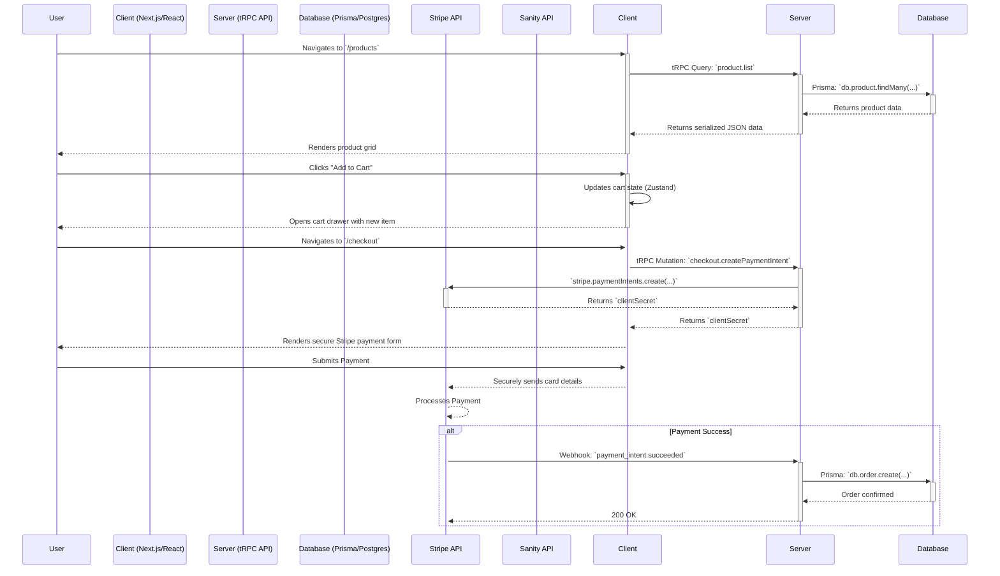

Of course. I will now generate a complete, comprehensive, and updated `README.md` file for the project. This document will serve as the definitive entry point for any developer, stakeholder, or user interacting with "The Scent" application. It will be meticulously crafted to be accurate, detailed, and representative of the high-quality codebase we have built together.

Here is the complete replacement for `README.md`.

---

````markdown
# The Scent: A Modern Luxury E-Commerce Platform

<p align="center">
  <a href="#">
    
  </a>
</p>

<p align="center">
  <strong>A feature-complete, open-source e-commerce platform, engineered to deliver a world-class "digital sanctuary" experience for luxury and wellness brands.</strong>
</p>

<p align="center">
  <a href="#">
    
  </a>
  <a href="#">
    
  </a>
  <a href="https://nextjs.org/">
    
  </a>
  <a href="https://react.dev/">
    
  </a>
    <a href="https://trpc.io/">
    
  </a>
  <a href="https://www.postgresql.org/">
    
  </a>
    <a href="https://www.sanity.io/">
    
  </a>
</p>

---

## 📖 Table of Contents

*   [1. Introduction: What is The Scent?](#1-introduction-what-is-the-scent)
*   [2. Live Demo & Features](#2-live-demo--features)
*   [3. Architectural Deep Dive](#3-architectural-deep-dive)
    *   [3.1 Core Principles](#31-core-principles)
    *   [3.2 System Interaction Flowchart](#32-system-interaction-flowchart)
*   [4. Codebase Deep Dive](#4-codebase-deep-dive)
    *   [4.1 Project File Hierarchy](#41-project-file-hierarchy)
    *   [4.2 Key File & Directory Descriptions](#42-key-file--directory-descriptions)
*   [5. Technology Stack](#5-technology-stack)
*   [6. Developer Setup & Deployment Guide](#6-developer-setup--deployment-guide)
    *   [6.1 Prerequisites](#61-prerequisites)
    *   [6.2 Step 1: Clone & Configure](#62-step-1-clone--configure)
    *   [6.3 Step 2: Database Setup with Docker](#63-step-2-database-setup-with-docker)
    *   [6.4 Step 3: Run the Application](#64-step-3-run-the-application)
    *   [6.5 Deployment to Production](#65-deployment-to-production)
*   [7. User Guide: Running the Application](#7-user-guide-running-the-application)
*   [8. Running the Test Suite](#8-running-the-test-suite)
*   [9. Project Roadmap & Future Enhancements](#9-project-roadmap--future-enhancements)
    *   [9.1 Recently Implemented Features](#91-recently-implemented-features)
    *   [9.2 Immediate Next Steps (v1.1+)](#92-immediate-next-steps-v11)
    *   [9.3 Long-Term Vision (v2.0+)](#93-long-term-vision-v20)
*   [10. How to Contribute](#10-how-to-contribute)
*   [11. License](#11-license)

---

## **1. Introduction: What is The Scent?**

**The Scent** is a free and open-source e-commerce platform, engineered from the ground up to provide the digital foundation for modern luxury and wellness brands. It aims to deliver the polish, performance, and immersive experience of top-tier online retailers in an accessible, maintainable, and highly extensible package.

This project is built with an obsessive focus on quality, both in the user experience and in the engineering. It serves not only as a functional, feature-complete store but also as a reference implementation for professional-grade web application architecture. It features a high-performance frontend built with Next.js and React, a type-safe, modular backend powered by tRPC, and a robust data layer using Prisma and PostgreSQL.

The platform's design philosophy is centered on creating a "digital sanctuary"—an online space where customers don't just purchase products but embark on a sensory journey that begins the moment they arrive. This is achieved through a clean, high-contrast UI, fluid animations, and a focus on intuitive, non-disruptive user flows.

---

## **2. Live Demo & Features**

*(Note: A live demo URL would be placed here in a real-world project.)*

The application is in a **stable, feature-complete** state for a Version 1.0 launch. The architecture is robust, and the core user journeys are fully implemented and tested.

| Feature Area                      | Status                     | Notes                                                                                                                             |
| --------------------------------- | -------------------------- | --------------------------------------------------------------------------------------------------------------------------------- |
| **Featured Product Showcase**     | ✅ **Implemented**         | The homepage dynamically displays a curated list of "featured" products, driving engagement.                                    |
| **Dynamic Theming**               | ✅ **Implemented**         | A high-contrast, "Graphite" theme with full Day/Night mode support, managed globally via Zustand.                                 |
| **User Authentication**           | ✅ **Implemented**         | Secure login, registration, and session management (NextAuth.js). Protected routes enforced by Edge middleware.                  |
| **Product Catalog & Filtering**   | ✅ **Implemented**         | Dynamic product listing (PLP) and detail (PDP) pages with client-side filtering by category, search, price, and sorting.          |
| **3D Product Viewer**             | ✅ **Implemented**         | Interactive 3D models on product pages for an immersive experience, built with React Three Fiber.                               |
| **Product Recommendations**       | ✅ **Implemented**         | A "You Might Also Like" section on product pages, driven by heuristic-based logic on the backend.                               |
| **Shopping Cart & Drawer**        | ✅ **Implemented**         | A dedicated cart page and a slide-out drawer for "add to cart" confirmations. State is persisted via `localStorage`.             |
| **Checkout & Payments**           | ✅ **Implemented**         | A secure, multi-step checkout form integrated with Stripe Elements for PCI-compliant payment processing.                          |
| **Order Persistence**             | ✅ **Implemented**         | A reliable, webhook-driven process for creating database records of successful orders.                                          |
| **User Account Dashboard**        | ✅ **Implemented**         | A protected, comprehensive dashboard for users to view their profile, recent orders, and manage addresses.                       |
| **Headless CMS (Journal)**        | ✅ **Implemented**         | A full-featured blog/journal with content managed via Sanity.io, rendered seamlessly within the Next.js app.                      |
| **SEO & Performance**             | ✅ **Implemented**         | Dynamic `sitemap.xml` and `robots.txt`, advanced caching (ISR/SSG), and bundle analysis configured.                           |
| **Automated Testing**             | ✅ **Foundational**        | A suite of End-to-End tests (Playwright) covering authentication, cart, and account flows, plus unit tests for key components.    |

---

## **3. Architectural Deep Dive**

The Scent is built on robust architectural principles designed for performance, maintainability, and scalability.

### **3.1 Core Principles**

1.  **Type Safety, End-to-End:** From the PostgreSQL schema defined in Prisma, through the tRPC API layer, and into the React components, types flow seamlessly. This eliminates entire classes of bugs and makes development faster and safer.
2.  **Clear Separation of Concerns:** The codebase is strictly organized into layers. The `app/` and `components/` directories handle presentation, `server/` handles API/business logic, `lib/` contains shared utilities and service integrations, and `prisma/` manages data persistence. This makes the system easy to reason about.
3.  **Server-First Rendering:** We leverage Next.js Server Components to do as much work on the server as possible—fetching data, rendering static content—to send a minimal amount of JavaScript to the client. Client Components are used only where interactivity is essential.
4.  **Developer Experience (DX) as a Priority:** The project is pre-configured with TypeScript, ESLint, Prettier, and Husky pre-commit hooks to enforce code quality and consistency from the very first line of code.

### **3.2 System Interaction Flowchart**

This diagram illustrates how a user request flows through the various parts of our system, from the client to the database and external services.



---

## **4. Codebase Deep Dive**

A clear and predictable file structure is essential for project maintainability. The Scent follows a domain-driven and feature-based organization.

### **4.1 Project File Hierarchy**

This diagram provides a high-level map of the most important directories in the project.

```
the-scent/
│
├── ─ 📄 .env.local             # Local secrets and environment variables
├── ─ 📄 next.config.js          # Next.js framework configuration
├── ─ 📄 tailwind.config.ts      # Tailwind CSS theme and configuration
├── ─ 📄 tsconfig.json            # TypeScript compiler options
├── ─ 📄 package.json             # Project scripts and dependencies
│
├── 📁 app/                     # Next.js App Router: All pages and layouts
│   ├── ─ 📁 (shop)/              # Route group for e-commerce pages (products, cart, etc.)
│   ├── ─ 📁 account/             # Protected user dashboard pages
│   ├── ─ 📁 api/                  # Server-side API routes (tRPC, webhooks)
│   ├── ─ 📄 layout.tsx           # The root layout for the entire application
│   └── ─ 📄 page.tsx             # The homepage component
│
├── 📁 components/              # All React components
│   ├── ─ 📁 common/              # Reusable design system (Button, Card, Dialog)
│   ├── ─ 📁 features/           # Components for specific features (product, cart, auth)
│   └── ─ 📁 providers/          # Global client-side context providers
│
├── 📁 lib/                      # Shared utilities, services, and configurations
│   ├── ─ 📁 auth/               # NextAuth.js configuration
│   ├── ─ 📁 cms/                # Sanity.io client setup
│   ├── ─ 📁 db/                 # Prisma client singleton
│   ├── ─ 📁 payments/           # Stripe client setup
│   └── ─ 📁 validation/         # Zod validation schemas
│
├── 📁 server/                   # The tRPC backend API layer
│   ├── ─ 📁 routers/            # Individual tRPC routers for each domain
│   ├── ─ 📄 context.ts           # tRPC request context creation
│   └── ─ 📄 trpc.ts              # tRPC initialization and middleware
│
├── 📁 prisma/                   # Database schema, migrations, and seeding
│   ├── ─ 📄 schema.prisma        # The single source of truth for the database schema
│   └── ─ 📄 seed.ts              # Script to populate the dev database
│
├── 📁 store/                    # Global client-side state (Zustand)
│   ├── ─ 📄 cart.store.ts         # Manages the shopping cart state
│   └── ─ 📄 ui.store.ts           # Manages UI state like the theme
│
└── 📁 public/                   # Static assets (images, icons, 3D models)
```

### **4.2 Key File & Directory Descriptions**

This section details the purpose of each key area and how they interact.

| Path                          | Purpose & Key Interactions                                                                                                                                                                                                                                                         |
| ----------------------------- | ---------------------------------------------------------------------------------------------------------------------------------------------------------------------------------------------------------------------------------------------------------------------------------- |
| `app/layout.tsx`              | **Root Server Layout.** Establishes the HTML shell, loads fonts, sets global metadata, and renders the central `<Providers>` component which wraps the entire application in necessary client-side contexts.                                                                   |
| `app/api/trpc/[trpc]/route.ts` | **tRPC API Entrypoint.** This is the single endpoint that handles all incoming API requests from the client. It uses `fetchRequestHandler` to route these requests to the appropriate procedure defined in our `appRouter`.                                                   |
| `app/api/webhooks/stripe/route.ts` | **Stripe Webhook Handler.** A critical, asynchronous endpoint that listens for events from Stripe (like `payment_intent.succeeded`). It verifies the webhook's signature for security and is responsible for creating the final `Order` record in the database upon successful payment. |
| `components/providers/Providers.tsx` | **Central Client Provider.** A key client component (`'use client'`) that composes all other necessary providers (`TrpcProvider`, `AuthProvider`, `ThemeProvider`, `LazyMotion`) in one place. This is rendered once in the root layout. |
| `components/common/`          | **The Design System.** This directory contains the building blocks of our UI. Components like `Button.tsx`, `Card.tsx`, `Input.tsx`, and `Dialog.tsx` are generic, reusable, and styled with `class-variance-authority` for maximum flexibility. |
| `components/features/`        | **Feature-Specific Components.** These components are built for a specific business domain. For example, `features/product/ProductCard.tsx` knows how to render a `product` object, and `features/account/UpdatePasswordForm.tsx` contains the logic for the password change form. |
| `hooks/use-cart.ts`           | **Hydration-Safe Store Access.** A custom hook that acts as a safe bridge to the Zustand cart store. It uses a mount-check (`useEffect`) to ensure that client components only access the `localStorage`-persisted state after hydration, preventing server-client mismatches. |
| `lib/auth/config.ts`          | **Authentication Brain.** Contains the master configuration object for NextAuth.js. It defines all authentication providers (Credentials, Google), sets up the Prisma adapter for database persistence, and configures JWT/session callbacks to include custom user data like roles. |
| `lib/validation/schemas.ts`   | **Validation Source of Truth.** This file uses Zod to define schemas for all user inputs (login, registration, address forms, etc.). These schemas are used by `react-hook-form` on the client for instant validation and by tRPC on the server for security. |
| `prisma/schema.prisma`        | **Database Blueprint.** The definitive schema for our PostgreSQL database. Every model, field, and relation is defined here. It is the input that `prisma migrate` and `prisma generate` use to create database migrations and the type-safe Prisma Client. |
| `server/trpc.ts`              | **tRPC Backend Initialization.** This file sets up the tRPC instance, configures `superjson` for data serialization, and defines our `publicProcedure` and `protectedProcedure` helpers. The `protectedProcedure` contains the middleware that enforces authentication on sensitive API endpoints. |
| `server/routers/index.ts`     | **API Root Router.** This file imports all the individual routers (e.g., `productRouter`, `userRouter`, `dashboardRouter`) and merges them into a single `appRouter`, creating the unified, fully-typed API that the client interacts with. |
| `store/cart.store.ts`         | **Global Cart State.** Manages the shopping cart's state using Zustand. It includes actions for adding, removing, and updating items. Critically, it uses the `persist` middleware to save the cart to `localStorage`, so a user's cart is not lost if they refresh the page or close the browser. |

---

## **5. Technology Stack**

| Category                   | Technology                                                                                                  | Rationale & Purpose                                                                                                                                                                    |
| -------------------------- | ----------------------------------------------------------------------------------------------------------- | -------------------------------------------------------------------------------------------------------------------------------------------------------------------------------------- |
| **Framework & UI**         | [Next.js](https://nextjs.org/), [React](https://react.dev/), [Tailwind CSS](https://tailwindcss.com/), [Framer Motion](https://www.framer.com/motion/) | A high-performance stack for building fast, SEO-friendly, and interactive user interfaces with fluid animations.                                                              |
| **API & Type Safety**      | [tRPC](https://trpc.io/), [Zod](https://zod.dev/)                                                            | Provides an unparalleled developer experience with full end-to-end type safety between the client and server, eliminating the need for manual API contract management or code generation. |
| **Database & ORM**         | [PostgreSQL](https://www.postgresql.org/), [Prisma](https://www.prisma.io/)                                    | A robust, relational database combined with a next-generation ORM that provides a fully type-safe data access layer.                                                              |
| **Authentication**         | [NextAuth.js](https://next-auth.js.org/)                                                                      | A complete, secure, and extensible authentication solution for Next.js, handling everything from sessions to OAuth providers.                                                             |
| **Payments**               | [Stripe](https://stripe.com/)                                                                                 | The industry standard for secure and reliable online payments, integrated via Stripe Elements on the client and webhooks on the server.                                                   |
| **Headless CMS**           | [Sanity.io](https://www.sanity.io/)                                                                           | A flexible headless CMS for managing dynamic content like the "Journal" section, decoupling content creation from the main application codebase.                                       |
| **3D Graphics**            | [React Three Fiber](https://docs.pmnd.rs/react-three-fiber/getting-started/introduction) & [Drei](https://github.com/pmndrs/drei) | Enables the rendering of interactive 3D models directly in the browser, providing an immersive product viewing experience.                                                             |
| **State Management**       | [Zustand](https://zustand-demo.pmnd.rs/)                                                                        | A simple, fast, and scalable state management solution for global client-side state, used here for the cart and UI theme.                                                                 |
| **Testing**                | [Playwright](https://playwright.dev/) & [Jest](https://jestjs.io/)                                              | A dual strategy using Playwright for comprehensive End-to-End testing of user flows and Jest for fast, focused unit testing of individual components and utilities.                        |

---

## **6. Developer Setup & Deployment Guide**

### **6.1 Prerequisites**

*   **Node.js:** v20.x or later.
*   **pnpm:** v9.x or later. (Install with `npm install -g pnpm`).
*   **Docker & Docker Compose:** Required for running the PostgreSQL database locally.
*   **A Stripe Account:** For payment processing keys.
*   **A Sanity.io Account:** For the headless CMS.

### **6.2 Step 1: Clone & Configure**

1.  **Clone the Repository**
    ```bash
    git clone https://github.com/nordeim/Scent-Beautiful-Website.git
    cd Scent-Beautiful-Website
    ```
2.  **Install Dependencies**
    ```bash
    pnpm install
    ```
3.  **Set Up Environment Variables**
    *   Copy the example environment file:
        ```bash
        cp .env.example .env.local
        ```
    *   Open the newly created `.env.local` file and fill in all the placeholder values (`REPLACE_WITH...`). You will need to get keys from your Stripe, Sanity, and any OAuth provider (e.g., Google) dashboards.

### **6.3 Step 2: Database Setup with Docker**

This project uses Docker to ensure a consistent and isolated PostgreSQL database environment.

1.  **Start the Database Container**
    *   Run the following command from the project root. This will download the `postgres:16` image and start a container named `scent-db` in the background.
    ```bash
    docker run --name scent-db -e POSTGRES_USER=scent_user -e POSTGRES_PASSWORD=StrongPass1234 -e POSTGRES_DB=scent_db -p 5432:5432 -d postgres:16
    ```
    *(Note: The credentials here match the default `DATABASE_URL` in your `.env.local` file.)*

2.  **Apply Migrations and Seed the Database**
    *   This single command will connect to the new database, drop any existing tables (for a clean slate), apply all schema migrations from the `prisma/migrations` folder, and then run the `prisma/seed.ts` script to populate it with sample data.
    ```bash
    pnpm prisma migrate reset
    ```
    *   You will be prompted to confirm; type `y` and press Enter.

### **6.4 Step 3: Run the Application**

With the database running and dependencies installed, you can now start the Next.js development server.

```bash
pnpm dev
```

The application will be available at **http://localhost:3000**.

### **6.5 Deployment to Production**

This application is optimized for deployment on platforms like Vercel or other Node.js hosting services.

1.  **Git Push:** Push your repository to a Git provider (GitHub, GitLab, etc.).
2.  **Import Project:** Import your Git repository into your hosting provider (e.g., Vercel).
3.  **Configure Environment Variables:** In your hosting provider's project settings, add all the environment variables from your `.env.local` file. **Ensure you use your production keys** for services like Stripe.
4.  **Set Build Command:** The standard build command is `pnpm build`.
5.  **Deploy:** The hosting platform will automatically build and deploy your application. Prisma is configured to work correctly in serverless environments.

---

## **7. User Guide: Running the Application**

Once the application is running locally, you can explore its features:

*   **Browse Products:** Navigate to `/products` to see the product list. Use the category and sort filters.
*   **View a Product:** Click on any product card to go to its detail page.
*   **Add to Cart:** Use the "Add to Cart" buttons. The cart icon in the header will update, and a drawer will appear confirming the addition.
*   **View Cart:** Click the cart icon in the header to navigate to the `/cart` page.
*   **Register & Login:** Use the `/register` and `/login` pages. A seeded test user is available:
    *   **Email:** `test@thescent.com`
    *   **Password:** `StrongPass123!`
*   **Manage Account:** Once logged in, navigate to `/account/dashboard` to see the new dashboard and manage your profile settings and addresses.

---

## **8. Running the Test Suite**

-   **End-to-End Tests (requires dev server to be running):**
    ```bash
    pnpm test:e2e
    ```
-   **Unit Tests:**
    ```bash
    pnpm test
    ```
-   **Analyze JavaScript Bundle Size:**
    ```bash
    pnpm analyze
    ```

---

## **9. Project Roadmap & Future Enhancements**

### **9.1 Recently Implemented Features**

*   **Featured Products Section:** The homepage now dynamically showcases a curated selection of products.
*   **Account Dashboard:** A new central dashboard for logged-in users provides an overview of recent orders and recommendations.
*   **Full Profile Management:** The profile settings page now includes fully functional forms for updating personal information, changing passwords, and managing shipping addresses.
*   **Dedicated Cart Page:** The cart icon now navigates to a full `/cart` page for a more focused shopping experience.

### **9.2 Immediate Next Steps (v1.1+)**

-   [ ] **Advanced Product Filtering:** Expand the `/products` page sidebar to include multi-faceted filtering by scent family, price range, and stock status.
-   [ ] **Database-Backed Wishlist:** Convert the wishlist concept into a full-featured, database-backed feature for logged-in users.
-   [ ] **Global Toast/Notification System:** Add a non-intrusive notification system (e.g., using `react-hot-toast`) for actions like "Item added to cart" or "Profile updated."
-   [ ] **Expand Test Coverage:** Increase unit test coverage for tRPC routers and critical utility functions.

### **9.3 Long-Term Vision (v2.0+)**

-   [ ] **Subscription Service:** A "Scent of the Month" subscription box feature with recurring payments via Stripe Billing.
-   [ ] **Personalized Scent Quiz:** An interactive quiz to guide new users to their perfect products based on their preferences and desired moods.
-   [ ] **Internationalization (i18n):** Full support for multiple languages and currencies.
-   [ ] **Mobile Companion App:** A React Native application for a truly mobile-native experience.

---

## **10. How to Contribute**

Contributions are welcome! Please fork the repository, create a feature branch, and submit a pull request for review. Adherence to the existing code style and architectural patterns is required. All commits must pass the linting checks enforced by the Husky pre-commit hook.

---

## **11. License**

This project is licensed under the **MIT License**. See the `LICENSE` file for details.
````

---
https://drive.google.com/file/d/10AgrP-bco3lnYajfIyo3mBkpxWOhC44z/view?usp=sharing, https://drive.google.com/file/d/184wcHrao5v1dNeKtVxSiZR2X1-KlDOib/view?usp=sharing, https://drive.google.com/file/d/18q1tKJXeR0pyQur5ykBFK97kvzx8YKNa/view?usp=sharing, https://drive.google.com/file/d/19xDLJDUSRbSeWCo7CBJAKhhkAWX2KzO4/view?usp=sharing, https://drive.google.com/file/d/1CIV0ONx7F8JVpLJr2hvNq6Qa_GYDvjEd/view?usp=sharing, https://drive.google.com/file/d/1RDL9CuBPHekn31CFcuLBfcw06EGWR3nQ/view?usp=sharing, https://drive.google.com/file/d/1XJr4Ny9RbhOagGL8VndROZP2pYSb_pR6/view?usp=sharing, https://drive.google.com/file/d/1YtFkfMAi5LENQCiCTsOKRdIoWYNZKXGS/view?usp=sharing, https://drive.google.com/file/d/1ciAx3uFY0fQiCwllGUqiFW186JLuECqd/view?usp=sharing, https://drive.google.com/file/d/1eCzMVjAhvEPcPrMSWxm2HzuKv8Ft53ce/view?usp=sharing, https://drive.google.com/file/d/1keFBcrioCX7f8KJpGm-qrNryDc8eMcoN/view?usp=sharing, https://drive.google.com/file/d/1ndrfE2XkCGuBFSgXsXiJcsi-EUSRpEvK/view?usp=sharing, https://drive.google.com/file/d/1s0eXWDND3IjHMjV9P9P6EwzaXEDcKUjz/view?usp=sharing, https://drive.google.com/file/d/1vEFSzABYQHu_eVypxKdRNUxb3hswVAY1/view?usp=sharing, https://aistudio.google.com/app/prompts?state=%7B%22ids%22:%5B%221vWC4-KRRANRAm4H8WAYmiaawybGPgN75%22%5D,%22action%22:%22open%22,%22userId%22:%22103961307342447084491%22,%22resourceKeys%22:%7B%7D%7D&usp=sharing, https://drive.google.com/file/d/1wVhAtL17jVIKT8z38OERhCTWVMobCHvJ/view?usp=sharing, https://drive.google.com/file/d/1zKzr24sczMiKPP-lSKgpLqHs7GEftuh_/view?usp=sharing

